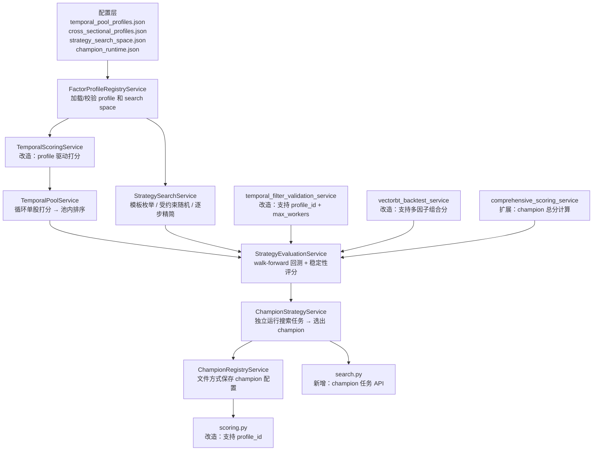
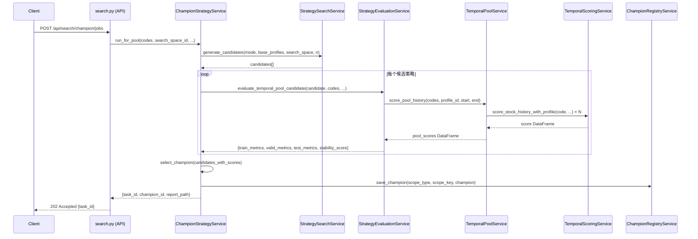
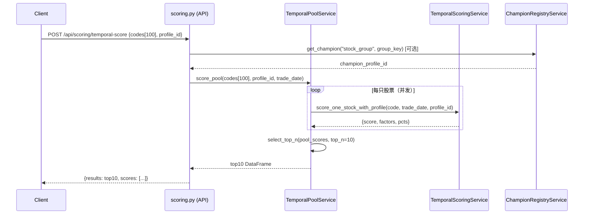

# Design Document: 自动化策略搜索与 Champion Strategy

## Overview

本功能将 FactorHub 从"固定 8 因子打分器"升级为"自动化策略搜索与应用平台"。核心思路是：把策略模板配置化，通过受约束搜索自动评选出最优 champion 策略，再统一接入 `temporal_pool`（单股时序打分循环汇总）和 `cross_sectional_filter`（截面因子组合打分）两条执行路径。

整个方案不引入新三方库，完全基于现有 `temporal_scoring_service`、`temporal_filter_validation_service`、`vectorbt_backtest_service`、`comprehensive_scoring_service` 等模块扩展实现，搜索结果以 JSON/CSV/Markdown 文件落盘，不新增数据库表。

## Architecture




## Sequence Diagrams

### Champion 搜索主流程



### 100→10 池内筛选流程




## Components and Interfaces

### Component 1: FactorProfileRegistryService

**Purpose**: 加载、校验、分发 profile 配置和 search space 配置，是整个系统的配置中枢。

**新增文件**: `backend/services/factor_profile_registry_service.py`

**Interface**:
```python
class FactorProfileRegistryService:
    def load_profiles(self, mode: str) -> list[dict]:
        """加载指定 mode 的所有 profile（temporal_pool / cross_sectional_filter）"""

    def get_profile(self, profile_id: str) -> dict:
        """按 profile_id 获取单个 profile，不存在时抛 KeyError"""

    def load_search_space(self, space_id: str) -> dict:
        """加载指定 search space 配置"""

    def validate_profile(self, profile: dict) -> None:
        """校验 profile 合法性，不合法时抛 ValueError（含详细原因）"""

    def list_profile_ids(self, mode: str | None = None) -> list[str]:
        """列出所有 profile_id，可按 mode 过滤"""
```

**Responsibilities**:
- 从 `config/temporal_pool_profiles.json` 和 `config/cross_sectional_profiles.json` 加载配置
- 校验 profile 字段完整性（id、mode、factors、params 必填）
- 校验因子权重之和为 1（signal 类因子）
- 提供热重载能力（文件变更后重新加载）

---

### Component 2: TemporalScoringService（改造）

**Purpose**: 在现有单股打分基础上，新增 profile 驱动接口，保持老接口不变。

**修改文件**: `backend/services/temporal_scoring_service.py`

**新增 Interface**:
```python
class TemporalScoringService:
    # 现有接口保持不变
    def score_one_stock(self, code: str, trade_date: str) -> dict: ...
    def score_stock_history(self, code: str, start_date: str, end_date: str, window: int = 252) -> pd.DataFrame: ...

    # 新增 profile 驱动接口
    def score_one_stock_with_profile(
        self, code: str, trade_date: str, profile_id: str
    ) -> dict:
        """按 profile 配置对单只股票打分，返回 {date, code, score, factors, pcts}"""

    def score_stock_history_with_profile(
        self, code: str, start_date: str, end_date: str,
        profile_id: str, window: int = 252
    ) -> pd.DataFrame:
        """按 profile 配置计算单只股票历史评分面板"""
```

**改造要点**:
- 现有 8 因子硬编码逻辑提取为 `default_temporal_v1` profile
- 新增 `_compute_factors_from_profile(df, profile)` 方法，按 profile 的 factors 列表动态计算
- 新增 `_compute_score_from_profile(pcts, profile)` 方法，按 profile 的 weight/direction/threshold 合成分数
- 缓存 key 加入 `profile_id` 版本信息，避免不同 profile 缓存冲突

---

### Component 3: TemporalPoolService

**Purpose**: 接收股票池 + profile_id，循环调用单股打分，汇总为池内排序结果，实现 100→10 场景。

**新增文件**: `backend/services/temporal_pool_service.py`

**Interface**:
```python
class TemporalPoolService:
    def score_pool(
        self, codes: list[str], profile_id: str, trade_date: str,
        max_workers: int = 4
    ) -> pd.DataFrame:
        """对股票池逐只打分，返回含 code/score/rank 的 DataFrame（按 score 降序）"""

    def select_top_n(
        self, pool_scores: pd.DataFrame, top_n: int,
        score_threshold: float | None = None
    ) -> pd.DataFrame:
        """从池内评分中选出 TopN，可选 score_threshold 过滤"""

    def score_pool_history(
        self, codes: list[str], profile_id: str,
        start_date: str, end_date: str, max_workers: int = 4
    ) -> pd.DataFrame:
        """构建历史池内评分面板，返回含 date/code/score/rank 的 DataFrame"""
```

**Responsibilities**:
- 并发调用 `TemporalScoringService.score_one_stock_with_profile`
- 每个交易日内按 score 降序排名（rank=1 为最高分）
- 支持 `score_threshold` 过滤（低于阈值的股票不进入 TopN）
- 错误隔离：单只股票失败不影响其他股票

---

### Component 4: StrategySearchService

**Purpose**: 生成候选策略，支持三层搜索：模板枚举 → 受约束随机 → 逐步精简。

**新增文件**: `backend/services/strategy_search_service.py`

**Interface**:
```python
class StrategySearchService:
    def generate_candidates(
        self, mode: str, base_profiles: list[dict],
        search_space: dict, n_candidates: int
    ) -> list[dict]:
        """生成候选策略列表（含 template_enum + constrained_random）"""

    def search_for_stock(
        self, code: str, search_space_id: str,
        start_date: str, end_date: str
    ) -> list[dict]:
        """为单只股票生成候选策略"""

    def search_for_pool(
        self, codes: list[str], search_space_id: str,
        start_date: str, end_date: str
    ) -> list[dict]:
        """为股票组生成候选策略"""

    def search_for_cross_sectional(
        self, universe: str, search_space_id: str,
        start_date: str, end_date: str
    ) -> list[dict]:
        """为截面 universe 生成候选策略"""

    def _template_enum(self, base_profiles: list[dict]) -> list[dict]:
        """第一层：枚举所有内置 profile 作为候选"""

    def _constrained_random(
        self, search_space: dict, n: int
    ) -> list[dict]:
        """第二层：受约束随机搜索（因子子集 + 权重 + 参数）"""

    def _forward_selection(
        self, top_candidates: list[dict], search_space: dict
    ) -> list[dict]:
        """第三层：在最优候选上做逐步精简"""
```

---

### Component 5: StrategyEvaluationService

**Purpose**: 统一时序池和截面两类策略的 walk-forward 评价逻辑，输出稳定性总分。

**新增文件**: `backend/services/strategy_evaluation_service.py`

**Interface**:
```python
class StrategyEvaluationService:
    def evaluate_temporal_pool_candidate(
        self, candidate: dict, codes: list[str],
        start_date: str, end_date: str,
        train_months: int = 12, valid_months: int = 3,
        test_months: int = 3, step_months: int = 3
    ) -> dict:
        """时序池候选策略 walk-forward 评价，返回 train/valid/test metrics + stability_score"""

    def evaluate_cross_sectional_candidate(
        self, candidate: dict, universe: str,
        start_date: str, end_date: str,
        train_months: int = 12, valid_months: int = 3,
        test_months: int = 3, step_months: int = 3
    ) -> dict:
        """截面候选策略 walk-forward 评价"""

    def compute_stability_score(self, window_metrics: list[dict]) -> float:
        """
        计算稳定性总分（0-100）：
        30% OOS Sharpe + 20% OOS excess return + 15% drawdown penalty
        + 10% IC/IR + 10% positive_window_ratio + 10% regime_consistency
        + 5% turnover penalty
        """

    def _run_walk_forward_windows(
        self, codes: list[str], profile: dict,
        start_date: str, end_date: str,
        train_months: int, valid_months: int,
        test_months: int, step_months: int
    ) -> list[dict]:
        """生成滚动窗口并逐窗口回测，返回每窗口的 metrics"""
```

---

### Component 6: ChampionStrategyService

**Purpose**: 独立运行搜索任务，从候选策略中选出最优 champion，保存配置和报告。

**新增文件**: `backend/services/champion_strategy_service.py`

**Interface**:
```python
class ChampionStrategyService:
    def run_for_stock(
        self, code: str, search_space_id: str,
        start_date: str, end_date: str
    ) -> dict:
        """为单只股票运行完整搜索流程，返回 champion 配置"""

    def run_for_pool(
        self, codes: list[str], search_space_id: str,
        start_date: str, end_date: str, max_workers: int = 1
    ) -> dict:
        """为股票组运行完整搜索流程，返回 champion 配置"""

    def run_for_cross_sectional(
        self, universe: str, search_space_id: str,
        start_date: str, end_date: str
    ) -> dict:
        """为截面 universe 运行完整搜索流程"""

    def get_champion(self, scope_type: str, scope_key: str) -> dict | None:
        """查询当前 champion 配置，不存在时返回 None"""

    def apply_champion(
        self, scope_type: str, scope_key: str, champion: dict
    ) -> None:
        """将 champion 写入 registry，供打分接口直接调用"""
```

---

### Component 7: ChampionRegistryService

**Purpose**: 文件方式持久化 champion 配置，不依赖数据库。

**新增文件**: `backend/services/champion_registry_service.py`

**Interface**:
```python
class ChampionRegistryService:
    # 存储路径：
    # data/champions/single_stock/{code}.json
    # data/champions/stock_group/{group_hash}.json
    # data/champions/cross_sectional/{universe}.json

    def save(self, scope_type: str, scope_key: str, champion: dict) -> Path:
        """保存 champion 配置，返回文件路径"""

    def load(self, scope_type: str, scope_key: str) -> dict | None:
        """加载 champion 配置，不存在时返回 None"""

    def list_champions(self, scope_type: str | None = None) -> list[dict]:
        """列出所有 champion（可按 scope_type 过滤）"""

    def delete(self, scope_type: str, scope_key: str) -> bool:
        """删除 champion 配置，返回是否成功"""

    def _scope_key_to_hash(self, codes: list[str]) -> str:
        """将股票列表转为稳定 hash（排序后 MD5）"""
```


## Data Models

### Model 1: StrategyProfile

```python
# 对应 temporal_pool_profiles.json / cross_sectional_profiles.json 中的单条记录
{
    "id": str,                    # 唯一标识，如 "momentum_v1"
    "mode": str,                  # "temporal_pool" | "cross_sectional_filter"
    "description": str,           # 人类可读描述
    "factors": [
        {
            "name": str,          # 因子名，需在 factor_service 中可计算
            "direction": int,     # 1=正向（越高越好），-1=反向
            "weight": float,      # signal 因子权重（risk_filter 因子 weight=0）
            "role": str,          # "signal" | "risk_filter"
            "threshold": float    # 仅 risk_filter 使用，百分位阈值
        }
    ],
    "params": {
        "rebalance": str,         # 调仓频率，如 "W-FRI"、"2W-FRI"
        "hold_days": int,         # 持有天数
        "top_n": int,             # 选股数量
        "score_threshold": float, # 最低分阈值（0-100）
        "percentile_window": int  # 百分位计算窗口（交易日数）
    },
    "version": str,               # 可选，版本号
    "source": str                 # "builtin" | "search_result" | "user_defined"
}
```

**Validation Rules**:
- `id` 非空，全局唯一
- `mode` 必须是 `temporal_pool` 或 `cross_sectional_filter`
- `factors` 非空，signal 因子权重之和 = 1.0（允许 ±0.001 误差）
- `params.top_n` 在 [1, 100] 范围内
- `params.percentile_window` 在 [20, 504] 范围内

---

### Model 2: StrategyCandidate

```python
{
    "candidate_id": str,          # UUID
    "profile_id": str,            # 对应的 profile id（内置或动态生成）
    "scope_type": str,            # "single_stock" | "stock_group" | "cross_sectional_universe"
    "scope_key": str,             # 股票代码 / group_hash / universe 名称
    "config": dict,               # 完整 profile 配置（含 factors + params）
    "train_metrics": dict,        # 训练期指标
    "valid_metrics": dict,        # 验证期指标
    "test_metrics": dict,         # 测试期指标
    "stability_score": float,     # 综合稳定性总分（0-100）
    "selected": bool              # 是否被选为 champion
}
```

---

### Model 3: ChampionStrategy

```python
{
    "champion_id": str,           # UUID
    "scope_type": str,            # "single_stock" | "stock_group" | "cross_sectional_universe"
    "scope_key": str,             # 股票代码 / group_hash / universe 名称
    "mode": str,                  # "temporal_pool" | "cross_sectional_filter"
    "profile_id": str,            # 对应的 profile id
    "config": dict,               # 完整 profile 配置
    "metrics": dict,              # 最终评估指标汇总
    "stability_score": float,     # 稳定性总分
    "selected_at": str,           # ISO 8601 时间戳
    "effective_from": str,        # 生效日期
    "report_path": str            # 报告文件路径
}
```

---

### Model 4: WalkForwardWindow

```python
{
    "window_id": int,
    "train_start": str,
    "train_end": str,
    "valid_start": str,
    "valid_end": str,
    "test_start": str,
    "test_end": str,
    "train_metrics": {
        "annual_return": float,
        "sharpe": float,
        "max_drawdown": float,
        "win_rate": float,
        "ic_mean": float,
        "ir": float
    },
    "valid_metrics": dict,        # 同 train_metrics 结构
    "test_metrics": dict,         # 同 train_metrics 结构
    "overfitting_flag": bool      # test Sharpe < 0.3 * train Sharpe 时标记
}
```

---

### Model 5: SearchTaskStatus

```python
{
    "task_id": str,
    "scope_type": str,
    "scope_key": str,
    "search_space_id": str,
    "status": str,                # "pending" | "running" | "completed" | "failed"
    "total_candidates": int,
    "evaluated_candidates": int,
    "progress": float,            # 0.0 - 100.0
    "started_at": str | None,
    "completed_at": str | None,
    "champion_id": str | None,
    "report_path": str | None,
    "error": str | None
}
```


## Algorithmic Pseudocode

### 主算法：Champion 搜索流程

```pascal
ALGORITHM run_champion_search(scope_type, scope_key, search_space_id, start_date, end_date)
INPUT: scope_type ∈ {"single_stock", "stock_group", "cross_sectional_universe"}
       scope_key: str (股票代码 / group_hash / universe)
       search_space_id: str
       start_date, end_date: str (YYYY-MM-DD)
OUTPUT: champion ∈ ChampionStrategy

BEGIN
  // Phase 1: 加载配置
  registry ← FactorProfileRegistryService()
  search_space ← registry.load_search_space(search_space_id)
  base_profiles ← registry.load_profiles(mode=infer_mode(scope_type))

  ASSERT len(base_profiles) > 0
  ASSERT search_space IS NOT NULL

  // Phase 2: 生成候选策略
  search_svc ← StrategySearchService()
  candidates ← search_svc.generate_candidates(
    mode=infer_mode(scope_type),
    base_profiles=base_profiles,
    search_space=search_space,
    n_candidates=search_space.get("n_candidates", 50)
  )

  ASSERT len(candidates) > 0

  // Phase 3: Walk-forward 评价（并发）
  eval_svc ← StrategyEvaluationService()
  evaluated ← []

  FOR each candidate IN candidates DO
    // 循环不变量：evaluated 中所有元素均已完成评价
    ASSERT all(e.stability_score IS NOT NULL for e in evaluated)

    TRY
      IF scope_type = "single_stock" THEN
        result ← eval_svc.evaluate_temporal_pool_candidate(
          candidate, [scope_key], start_date, end_date
        )
      ELSE IF scope_type = "stock_group" THEN
        result ← eval_svc.evaluate_temporal_pool_candidate(
          candidate, decode_group(scope_key), start_date, end_date
        )
      ELSE
        result ← eval_svc.evaluate_cross_sectional_candidate(
          candidate, scope_key, start_date, end_date
        )
      END IF
      evaluated.append({...candidate, ...result})
    CATCH Exception AS e
      log_warning(f"候选策略评价失败: {e}")
      CONTINUE
    END TRY
  END FOR

  IF len(evaluated) = 0 THEN
    RAISE RuntimeError("所有候选策略评价均失败")
  END IF

  // Phase 4: 过滤明显失效候选
  valid_candidates ← [c for c in evaluated
    IF c.test_metrics.sharpe > 0
    AND c.test_metrics.annual_return > -0.20]

  IF len(valid_candidates) = 0 THEN
    valid_candidates ← evaluated  // 降级：不过滤，取最优
  END IF

  // Phase 5: 按稳定性总分排序，选出 champion
  valid_candidates.sort(key=lambda c: c.stability_score, descending=True)
  best ← valid_candidates[0]

  champion ← ChampionStrategy(
    champion_id=uuid4(),
    scope_type=scope_type,
    scope_key=scope_key,
    mode=best.config.mode,
    profile_id=best.profile_id,
    config=best.config,
    metrics=best.test_metrics,
    stability_score=best.stability_score,
    selected_at=now_iso(),
    effective_from=end_date
  )

  ASSERT champion.stability_score >= 0

  // Phase 6: 落盘
  ChampionRegistryService().save(scope_type, scope_key, champion)
  save_leaderboard(evaluated, task_dir)
  save_report(champion, evaluated, task_dir)

  RETURN champion
END
```

**Preconditions**:
- `search_space_id` 对应的配置文件存在且合法
- `start_date` < `end_date`，时间跨度 ≥ 18 个月（保证至少 1 个完整 walk-forward 窗口）
- 股票代码列表非空，且历史数据可获取

**Postconditions**:
- champion 配置已写入 `data/champions/{scope_type}/{scope_key}.json`
- leaderboard CSV 和 selection_report.md 已写入 `data/reports/strategy_search/{task_id}/`
- 返回的 champion 包含完整的 config 和 metrics

**Loop Invariants**:
- 每次迭代后 `evaluated` 中的元素数量单调递增
- 所有已评价候选的 `stability_score` 均为有效浮点数

---

### 算法：受约束随机候选生成

```pascal
ALGORITHM constrained_random_search(search_space, n)
INPUT: search_space ∈ SearchSpace
       n: int (候选数量)
OUTPUT: candidates: list[dict]

BEGIN
  candidates ← []
  max_attempts ← n * 10
  attempts ← 0

  WHILE len(candidates) < n AND attempts < max_attempts DO
    attempts ← attempts + 1

    // Step 1: 随机选择因子子集
    n_factors ← random_int(search_space.min_factors, search_space.max_factors)
    selected_factors ← []

    FOR each group_name, group_factors IN search_space.factor_groups DO
      max_from_group ← min(search_space.max_per_group, len(group_factors))
      n_from_group ← random_int(0, max_from_group)
      selected_factors.extend(random_sample(group_factors, n_from_group))
    END FOR

    // 约束：总因子数在范围内
    IF len(selected_factors) < search_space.min_factors THEN
      CONTINUE
    END IF
    IF len(selected_factors) > search_space.max_factors THEN
      selected_factors ← random_sample(selected_factors, search_space.max_factors)
    END IF

    // 约束：必须包含至少 1 个风险过滤因子
    risk_factors ← [f for f in selected_factors IF f IN search_space.risk_factors]
    IF len(risk_factors) = 0 THEN
      CONTINUE
    END IF

    // Step 2: 随机分配权重（signal 因子）
    signal_factors ← [f for f in selected_factors IF f NOT IN search_space.risk_factors]
    weights ← dirichlet_sample(len(signal_factors))  // 权重和为 1

    // 约束：单因子权重不超过 0.40
    IF max(weights) > 0.40 THEN
      CONTINUE
    END IF

    // Step 3: 随机选择参数
    params ← {
      "rebalance": random_choice(search_space.rebalance_choices),
      "hold_days": random_choice(search_space.hold_days_choices),
      "top_n": random_choice(search_space.top_n_choices),
      "score_threshold": random_choice(search_space.score_threshold_choices),
      "percentile_window": 252
    }

    candidate ← build_profile(signal_factors, weights, risk_factors, params)
    candidates.append(candidate)
  END WHILE

  ASSERT len(candidates) > 0
  RETURN candidates
END
```

**Preconditions**:
- `search_space.min_factors` ≤ `search_space.max_factors`
- `search_space.factor_groups` 非空
- `n` > 0

**Postconditions**:
- 返回的每个候选 signal 因子权重之和 = 1.0（±0.001）
- 每个候选至少包含 1 个风险过滤因子
- 每个候选因子总数在 [min_factors, max_factors] 范围内

---

### 算法：Walk-Forward 窗口评价

```pascal
ALGORITHM walk_forward_evaluate(codes, profile, start_date, end_date,
                                  train_months, valid_months, test_months, step_months)
INPUT: codes: list[str]
       profile: dict
       start_date, end_date: str
       train_months, valid_months, test_months, step_months: int
OUTPUT: window_metrics: list[WalkForwardWindow]
        stability_score: float

BEGIN
  windows ← generate_windows(start_date, end_date,
    train_months, valid_months, test_months, step_months)

  ASSERT len(windows) >= 1

  window_metrics ← []

  FOR each window IN windows DO
    // 循环不变量：window_metrics 中所有元素均包含完整的 train/valid/test metrics
    ASSERT all(w.test_metrics IS NOT NULL for w in window_metrics)

    // 构建历史评分面板
    pool_svc ← TemporalPoolService()
    train_scores ← pool_svc.score_pool_history(
      codes, profile.id, window.train_start, window.train_end
    )
    test_scores ← pool_svc.score_pool_history(
      codes, profile.id, window.test_start, window.test_end
    )

    // 回测
    train_bt ← run_pool_backtest(train_scores, profile.params)
    test_bt ← run_pool_backtest(test_scores, profile.params)

    // 过拟合检测
    overfitting ← (test_bt.sharpe < 0.3 * train_bt.sharpe)

    window_metrics.append(WalkForwardWindow(
      window_id=len(window_metrics),
      train_metrics=train_bt,
      test_metrics=test_bt,
      overfitting_flag=overfitting
    ))
  END FOR

  // 计算稳定性总分
  stability_score ← compute_stability_score(window_metrics)

  ASSERT 0 <= stability_score <= 100
  RETURN window_metrics, stability_score
END
```

---

### 算法：Champion 稳定性总分

```pascal
ALGORITHM compute_stability_score(window_metrics)
INPUT: window_metrics: list[WalkForwardWindow]
OUTPUT: score: float ∈ [0, 100]

BEGIN
  test_sharpes ← [w.test_metrics.sharpe for w in window_metrics]
  test_excess_returns ← [w.test_metrics.excess_return for w in window_metrics]
  test_drawdowns ← [w.test_metrics.max_drawdown for w in window_metrics]
  test_irs ← [w.test_metrics.ir for w in window_metrics]
  positive_windows ← [1 IF w.test_metrics.annual_return > 0 ELSE 0 for w in window_metrics]

  // 各分项归一化到 [0, 1]
  sharpe_score ← clip(mean(test_sharpes) / 2.0, 0, 1)          // Sharpe=2 满分
  excess_score ← clip(mean(test_excess_returns) / 0.15, 0, 1)  // 超额15%满分
  drawdown_score ← clip(1 - mean(abs(test_drawdowns)) / 0.30, 0, 1)  // 回撤30%得0分
  ir_score ← clip(mean(test_irs) / 1.5, 0, 1)                  // IR=1.5 满分
  positive_ratio ← mean(positive_windows)
  regime_score ← 1 - std(test_sharpes) / (mean(abs(test_sharpes)) + 0.01)  // 窗口间一致性
  regime_score ← clip(regime_score, 0, 1)
  turnover_score ← clip(1 - mean(turnover_rates) / 1.0, 0, 1)  // 换手率100%得0分

  score ← 100 * (
    0.30 * sharpe_score
    + 0.20 * excess_score
    + 0.15 * drawdown_score
    + 0.10 * ir_score
    + 0.10 * positive_ratio
    + 0.10 * regime_score
    + 0.05 * turnover_score
  )

  ASSERT 0 <= score <= 100
  RETURN score
END
```


## Key Functions with Formal Specifications

### TemporalScoringService.score_one_stock_with_profile

```python
def score_one_stock_with_profile(
    self, code: str, trade_date: str, profile_id: str
) -> dict:
```

**Preconditions**:
- `code` 为 6 位数字字符串（深市补零）
- `trade_date` 格式为 `YYYY-MM-DD`
- `profile_id` 在 `FactorProfileRegistryService` 中存在
- 该股票在 `trade_date` 前有至少 `percentile_window + 20` 个交易日数据

**Postconditions**:
- 返回 `{date, code, score, factors, pcts}` 字典
- `score` ∈ [0, 100]
- `pcts` 中每个因子百分位 ∈ [0, 1]
- `date` 为实际使用的交易日（非传入的 `trade_date`，可能回退到最近交易日）

**Loop Invariants**: N/A（无循环）

---

### TemporalPoolService.score_pool

```python
def score_pool(
    self, codes: list[str], profile_id: str, trade_date: str,
    max_workers: int = 4
) -> pd.DataFrame:
```

**Preconditions**:
- `codes` 非空，长度 ≥ 1
- `profile_id` 合法
- `max_workers` ≥ 1

**Postconditions**:
- 返回 DataFrame 包含列：`code`, `score`, `rank`
- `rank` 为 1-based 降序排名（score 最高者 rank=1）
- 评分失败的股票不出现在结果中（错误隔离）
- 结果按 `score` 降序排列

**Loop Invariants**:
- 并发执行时，每只股票的评分结果独立，互不影响

---

### StrategyEvaluationService.compute_stability_score

```python
def compute_stability_score(self, window_metrics: list[dict]) -> float:
```

**Preconditions**:
- `window_metrics` 非空，长度 ≥ 1
- 每个 window 包含 `test_metrics` 字段，含 `sharpe`, `annual_return`, `max_drawdown`, `ir`

**Postconditions**:
- 返回值 ∈ [0.0, 100.0]
- 所有 window 的 test Sharpe 均为负时，返回值 < 30
- 所有 window 的 test Sharpe 均 > 2 且回撤 < 5% 时，返回值 > 80

**Loop Invariants**: N/A（无循环，纯计算）

---

### ChampionRegistryService.save

```python
def save(self, scope_type: str, scope_key: str, champion: dict) -> Path:
```

**Preconditions**:
- `scope_type` ∈ `{"single_stock", "stock_group", "cross_sectional_universe"}`
- `scope_key` 非空字符串
- `champion` 包含 `champion_id`, `config`, `metrics`, `stability_score` 字段

**Postconditions**:
- 文件写入成功，路径为 `data/champions/{scope_type}/{scope_key}.json`
- 文件内容为合法 JSON，可被 `load` 方法读回
- 返回写入文件的 `Path` 对象

**Loop Invariants**: N/A


## Example Usage

### 示例 1：100→10 池内筛选（调用 TemporalPoolService）

```python
from backend.services.temporal_pool_service import TemporalPoolService

pool_svc = TemporalPoolService()

# 对 100 只股票按 momentum_v1 profile 打分
pool_scores = pool_svc.score_pool(
    codes=candidate_100_codes,
    profile_id="momentum_v1",
    trade_date="2026-03-21",
    max_workers=4
)

# 取前 10，score 阈值 70
top10 = pool_svc.select_top_n(pool_scores, top_n=10, score_threshold=70)
print(top10[["code", "score", "rank"]])
```

### 示例 2：为股票组运行 Champion 搜索

```python
from backend.services.champion_strategy_service import ChampionStrategyService

champion_svc = ChampionStrategyService()

champion = champion_svc.run_for_pool(
    codes=["600519", "000001", "300750", ...],  # 候选股票池
    search_space_id="temporal_default",
    start_date="2022-01-01",
    end_date="2025-12-31",
    max_workers=2
)

print(f"Champion profile: {champion['profile_id']}")
print(f"Stability score: {champion['stability_score']:.1f}")
print(f"OOS Sharpe: {champion['metrics']['sharpe']:.2f}")
```

### 示例 3：查询并应用 Champion

```python
from backend.services.champion_registry_service import ChampionRegistryService
from backend.services.temporal_pool_service import TemporalPoolService

registry = ChampionRegistryService()
champion = registry.load("stock_group", group_hash)

if champion:
    pool_svc = TemporalPoolService()
    top10 = pool_svc.score_pool(
        codes=pool_codes,
        profile_id=champion["profile_id"],
        trade_date="2026-03-21"
    )
```

### 示例 4：通过 API 启动搜索任务

```python
import httpx

# 启动异步搜索任务
resp = httpx.post("http://localhost:8000/api/search/champion/jobs", json={
    "scope_type": "stock_group",
    "codes": ["600519", "000001", "300750"],
    "search_space_id": "temporal_default",
    "start_date": "2022-01-01",
    "end_date": "2025-12-31",
    "max_workers": 2
})
task_id = resp.json()["task_id"]

# 轮询任务状态
status = httpx.get(f"http://localhost:8000/api/search/champion/jobs/{task_id}").json()
print(status["status"], status["progress"])

# 查询 champion
champion = httpx.get(
    f"http://localhost:8000/api/search/champions/stock_group/{group_key}"
).json()
```


## Error Handling

### Error Scenario 1: Profile 不存在

**Condition**: 调用 `get_profile(profile_id)` 时 profile_id 不在配置文件中
**Response**: 抛出 `KeyError(f"Profile '{profile_id}' not found")`
**Recovery**: API 层捕获后返回 HTTP 404，前端提示用户选择有效 profile

### Error Scenario 2: 股票历史数据不足

**Condition**: 股票在指定时间段内有效交易日数 < `percentile_window + 20`
**Response**: `score_one_stock_with_profile` 抛出 `ValueError`，`score_pool` 跳过该股票并记录错误
**Recovery**: 返回结果中不包含该股票，`errors` 字段记录失败原因；不影响其他股票评分

### Error Scenario 3: 搜索任务全部候选评价失败

**Condition**: `walk_forward_evaluate` 对所有候选策略均抛出异常
**Response**: `ChampionStrategyService` 抛出 `RuntimeError("所有候选策略评价均失败")`
**Recovery**: 任务状态置为 `failed`，写入 `task_status.json`；建议用户检查数据质量或缩短时间范围

### Error Scenario 4: Champion 文件写入失败

**Condition**: `data/champions/` 目录无写权限或磁盘满
**Response**: `ChampionRegistryService.save` 抛出 `IOError`
**Recovery**: 搜索结果仍保存在 `data/reports/strategy_search/{task_id}/`，可手动恢复

### Error Scenario 5: max_workers 透传问题

**Condition**: 调用方未显式传 `max_workers`，底层默认使用 4 线程导致并发过高
**Response**: 所有接口均要求显式传入 `max_workers`，默认值为 `1`（保守）
**Recovery**: 用户可通过 API 请求体或配置文件 `champion_runtime.json` 调整

## Correctness Properties

*属性（Property）是在系统所有合法执行中都应成立的特征或行为——本质上是对系统应做什么的形式化陈述。属性是人类可读规范与机器可验证正确性保证之间的桥梁。*

### Property 1：单股打分分数范围不变量

*对任意*合法 profile 和有足够历史数据的股票，`score_one_stock_with_profile` 返回的 `score` 值始终在 [0, 100] 范围内，`pcts` 中每个因子百分位值始终在 [0, 1] 范围内。

**Validates: Requirements 2.3, 2.4**

### Property 2：池内排名连续整数不变量

*对任意*非空股票列表，`score_pool` 返回的 `rank` 列是从 1 开始的连续整数序列，且 score 最高的股票 rank=1。

**Validates: Requirements 3.2**

### Property 3：TopN 数量上界不变量

*对任意*池内评分 DataFrame 和 `top_n` 参数，`select_top_n` 返回的行数不超过 `top_n`。

**Validates: Requirements 3.6**

### Property 4：score_threshold 过滤正确性

*对任意*池内评分和 `score_threshold` 参数，`select_top_n` 返回结果中所有股票的 score 均大于等于 `score_threshold`。

**Validates: Requirements 3.7**

### Property 5：受约束随机搜索权重归一化

*对任意*合法搜索空间配置，`_constrained_random` 生成的每个候选策略的 signal 因子权重之和在 [0.999, 1.001] 范围内。

**Validates: Requirements 4.3**

### Property 6：受约束随机搜索约束满足性

*对任意*合法搜索空间配置，`_constrained_random` 生成的每个候选策略均满足：至少包含 1 个 `risk_filter` 因子、因子总数在 `[min_factors, max_factors]` 范围内、同组因子数不超过 `max_per_group`、单因子权重不超过 0.40。

**Validates: Requirements 4.4, 4.5, 4.6, 4.7**

### Property 7：稳定性总分范围不变量

*对任意*非空 `window_metrics` 输入，`compute_stability_score` 返回值始终在 [0.0, 100.0] 范围内。

**Validates: Requirements 5.7**

### Property 8：Champion 注册表 save/load round-trip

*对任意*合法 champion 配置，调用 `save(scope_type, scope_key, champion)` 后立即调用 `load(scope_type, scope_key)`，返回内容与保存内容完全一致（JSON 序列化/反序列化 round-trip）。

**Validates: Requirements 7.3**

### Property 9：Champion 注册表按 scope_type 过滤正确性

*对任意* scope_type，`list_champions(scope_type)` 返回的列表中所有元素的 `scope_type` 字段均等于指定值。

**Validates: Requirements 7.5**

### Property 10：group_hash 顺序无关性

*对任意*股票代码列表，将其以任意顺序传入 `_scope_key_to_hash`，返回的 hash 值始终相同。

**Validates: Requirements 7.8**

### Property 11：深市股票代码前导零保留

*对任意*以 `0` 开头的 6 位深市股票代码，经过系统处理后代码字符串保持不变，不丢失前导零。

**Validates: Requirements 8.8**

### Property 12：回测持仓顺序无关性

*对任意*持仓集合，以不同顺序输入 `vectorbt_backtest_service` 时，产生的回测净值曲线完全相同。

**Validates: Requirements 11.1**

### Property 13：Champion 稳定性总分非负性

*对任意*搜索任务，`ChampionStrategyService` 选出的 champion 的 `stability_score` 始终大于等于 0。

**Validates: Requirements 6.10**

### Property 14：Walk-Forward 窗口无重叠覆盖完整性

*对任意*合法时间范围和窗口参数，`_run_walk_forward_windows` 生成的窗口集合满足：各窗口的训练期、验证期、测试期互不重叠，且整体覆盖完整的指定时间范围。

**Validates: Requirements 5.3, 5.4**

## Testing Strategy

### Unit Testing Approach

- `FactorProfileRegistryService`: 测试 profile 加载、校验（合法/非法配置）、profile_id 查找
- `TemporalPoolService.select_top_n`: 测试 TopN 选择、score_threshold 过滤、边界情况（空池、全部低于阈值）
- `StrategySearchService._constrained_random`: 测试生成的候选满足所有约束（因子数、权重和、风险因子）
- `ChampionRegistryService`: 测试 save/load/delete 的文件操作正确性
- `compute_stability_score`: 测试极端输入（全负 Sharpe、全正 Sharpe、单窗口）

### Property-Based Testing Approach

**Property Test Library**: `hypothesis`

- **属性 1**: 对任意合法 profile，`score_one_stock_with_profile` 返回的 score ∈ [0, 100]
- **属性 2**: 对任意非空股票列表，`score_pool` 返回的 rank 是从 1 开始的连续整数
- **属性 3**: `compute_stability_score` 对任意 window_metrics 输入，返回值 ∈ [0, 100]
- **属性 4**: `_constrained_random` 生成的所有候选，signal 因子权重之和 ∈ [0.999, 1.001]
- **属性 5**: `ChampionRegistryService.save` 后立即 `load`，返回内容与保存内容一致

### Integration Testing Approach

- 端到端测试：从 `POST /api/search/champion/jobs` 到 champion 文件落盘的完整流程
- 100→10 场景测试：输入 100 只股票，验证输出恰好 ≤ 10 只（含 score_threshold 过滤场景）
- Walk-forward 窗口生成测试：验证窗口无重叠、覆盖完整时间范围

## Performance Considerations

- `score_pool_history` 对 100 只股票并发打分，建议 `max_workers=4`，单次调用预计 30-60 秒
- Champion 搜索（50 个候选 × 3 年数据）预计耗时 10-30 分钟，必须异步执行
- 评分结果缓存 key 格式：`{code}_{start_date}_{end_date}_{profile_id}.parquet`，避免重复计算
- Walk-forward 窗口间可复用重叠时间段的评分缓存
- 生产环境建议离线运行 champion 搜索（每日/每周），在线只读取 champion 配置

## Security Considerations

- 配置文件（`config/*.json`）不包含敏感信息，但需防止路径遍历攻击（`profile_id` 不能含 `/` 或 `..`）
- `scope_key` 用于文件路径时需做 sanitize（替换非法字符）
- API 端点不暴露内部文件路径，`report_path` 仅返回相对路径

## Dependencies

**现有依赖（复用）**:
- `pandas`, `numpy`, `scipy` - 数据处理和统计计算
- `concurrent.futures.ThreadPoolExecutor` - 并发打分
- `pathlib`, `json`, `threading` - 文件操作和任务管理
- `vectorbt` - 截面回测（已有 `vectorbt_backtest_service`）
- `fastapi`, `pydantic` - API 层

**新增配置文件**:
- `config/temporal_pool_profiles.json`
- `config/cross_sectional_profiles.json`
- `config/strategy_search_space.json`
- `config/champion_runtime.json`

**新增服务文件**:
- `backend/services/factor_profile_registry_service.py`
- `backend/services/temporal_pool_service.py`
- `backend/services/strategy_search_service.py`
- `backend/services/strategy_evaluation_service.py`
- `backend/services/champion_strategy_service.py`
- `backend/services/champion_registry_service.py`

**新增 API 文件**:
- `backend/api/routers/search.py`

**修改文件**:
- `backend/services/temporal_scoring_service.py` - 新增 profile 驱动接口
- `backend/services/temporal_filter_validation_service.py` - 支持 profile_id + max_workers
- `backend/services/vectorbt_backtest_service.py` - 支持多因子组合分截面回测
- `backend/api/routers/scoring.py` - 支持 profile_id 参数
- `backend/api/main.py` - 注册 search router
