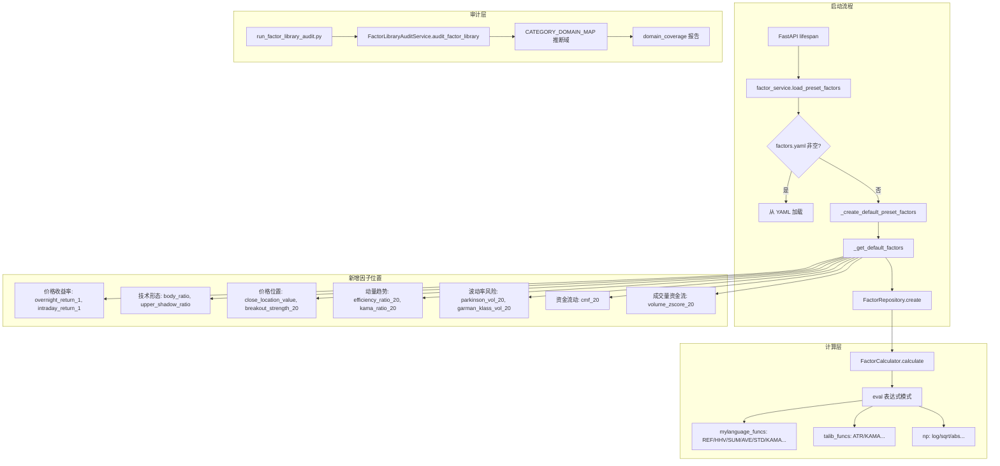
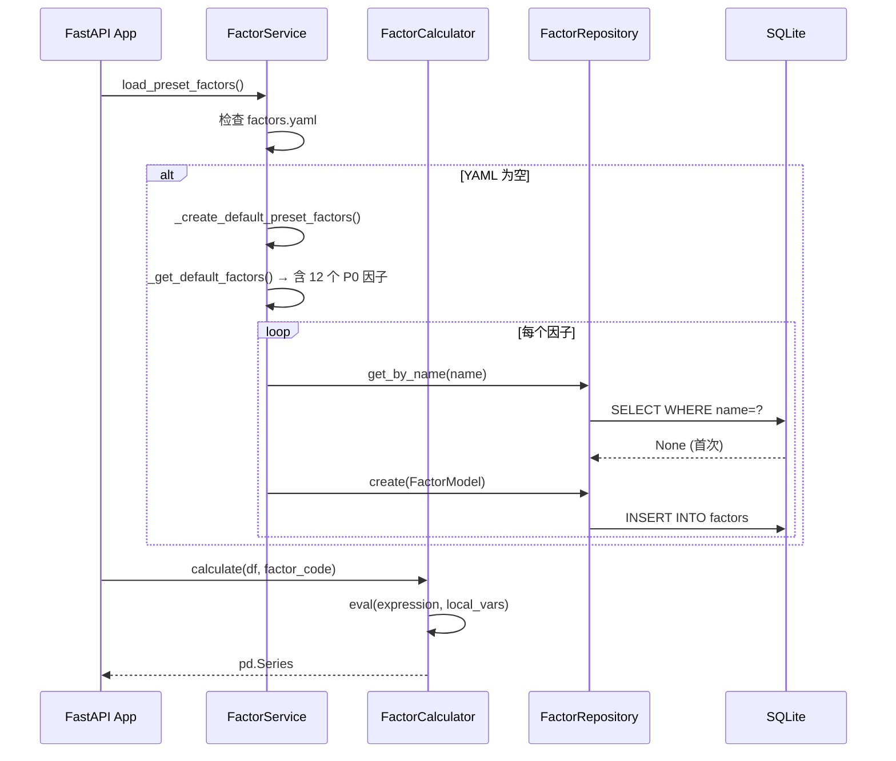

# 设计文档：OHLCV 因子扩展（ohlcv-factor-expansion）

## 概述

在不引入任何外部数据、只使用日频 OHLCV 的前提下，向现有因子库补充 12 个 P0 正交时序因子，覆盖隔夜/盘中拆分、K 线结构、突破强度、趋势质量、高阶波动率、增强量价流、自适应趋势七个子域。新因子全部以 `formula_type="expression"` 接入现有 `_get_default_factors()` 内置预置，复用现有 `FactorCalculator`、`FactorRepository` 和 `FactorLibraryAuditService`，不改动数据库 schema、不修改 API 契约、不影响评分链路。

---

## 架构



---

## 序列图：预置因子加载流程



---

## 组件与接口

### FactorCalculator（现有，无需修改）

**接口**：
```python
class FactorCalculator:
    def calculate(self, df: pd.DataFrame, factor_code: str) -> pd.Series: ...
    def calculate_multiple(self, df: pd.DataFrame, factors: List[FactorModel]) -> pd.DataFrame: ...
```

**local_vars 中已可用**：`open, high, low, close, volume, np, REF, HHV, LLV, SUM, AVE, STD, COUNT, MAX, MIN, ATR, KAMA, WILLR, ...`

**新增因子所需函数**（已全部存在）：
- `REF(series, n)` — 引用 n 日前值
- `HHV(series, n)` — n 日最高值
- `SUM(series, n)` — n 日求和
- `AVE(series, n)` — n 日均值
- `STD(series, n)` — n 日标准差
- `ATR(high, low, close, timeperiod=n)` — TA-Lib ATR
- `KAMA(close, timeperiod=n)` — TA-Lib KAMA
- `np.sqrt / np.log / np.abs` — NumPy 数学函数

### FactorService._get_default_factors()（修改目标）

**职责**：返回按分类组织的预置因子字典，新增 12 个 P0 因子条目。

**接口**（不变）：
```python
def _get_default_factors(self) -> Dict[str, List[Dict]]:
    # 返回 {"分类名": [{"name": str, "code": str, "description": str}, ...]}
```

**注意**：`_create_default_preset_factors()` 创建 `FactorModel` 时不传 `formula_type` 和 `is_active`，靠 model 字段默认值（`formula_type="expression"`，`is_active=1`）。新增因子的字典条目只需包含 `name`、`code`、`description` 三个字段，与现有因子格式完全一致。

### FactorLibraryAuditService（现有，无需修改）

`CATEGORY_DOMAIN_MAP` 已包含所有新增分类的映射：
- `"价格收益率"` → `["trend", "price_position"]`
- `"技术形态"` → `["pattern_regime"]`
- `"价格位置"` → `["price_position"]`
- `"动量趋势"` → `["trend", "momentum"]`
- `"波动率风险"` → `["volatility", "risk"]`
- `"资金流动"` → `["volume_flow"]`
- `"成交量资金流"` → `["volume_flow"]`

---

## 数据模型

### FactorModel（现有，不变）

```python
class FactorModel(Base):
    __tablename__ = "factors"
    id: int           # PK
    name: str         # unique, max 100 chars
    code: str         # 表达式字符串
    description: str
    source: str       # "preset" | "user"
    category: str     # 分类名
    formula_type: str # "expression" | "function"
    is_active: int    # 0 | 1
```

### 新增因子定义规范

所有 P0 因子遵循以下约束：
- `source = "preset"`
- `formula_type = "expression"`
- `is_active = 1`
- 分母统一加 `1e-12` 防零除
- 突破/新高类引用 `.shift(1)` 历史区间，避免未来函数

---

## 关键函数与形式化规格

### P0 因子表达式规格

#### overnight_return_1（隔夜跳空收益）

```python
open / REF(close, 1) - 1
```

**前置条件**：`close` 序列长度 ≥ 2，`REF(close,1)` 不为零  
**后置条件**：返回 `pd.Series`，第 1 行为 NaN（warmup），其余为实数  
**循环不变量**：N/A（向量化表达式）

#### intraday_return_1（盘中强弱）

```python
close / open - 1
```

**前置条件**：`open > 0`（实际数据保证）  
**后置条件**：无 warmup NaN，值域 `(-1, +∞)`

#### body_ratio（K 线实体强度）

```python
(close - open) / (high - low + 1e-12)
```

**前置条件**：`high >= low`（OHLCV 数据约束）  
**后置条件**：值域 `[-1, 1]`，`high == low` 时趋近 0

#### upper_shadow_ratio（上影线抛压）

```python
(high - MAX(open, close)) / (high - low + 1e-12)
```

**前置条件**：`high >= MAX(open, close) >= low`  
**后置条件**：值域 `[0, 1]`

#### close_location_value（收盘位于日内区间位置）

```python
(close - low) / (high - low + 1e-12)
```

**前置条件**：`high >= close >= low`  
**后置条件**：值域 `[0, 1]`，`high == low` 时趋近 0

#### breakout_strength_20（ATR 归一化突破强度）

```python
(close - HHV(high, 20).shift(1)) / (ATR(high, low, close, timeperiod=14) + 1e-12)
```

**前置条件**：序列长度 ≥ 20，ATR 需 14 日 warmup  
**后置条件**：warmup NaN 数量 = max(20, 14) = 20 行；正值表示突破，负值表示未突破  
**防未来函数**：`HHV(high, 20).shift(1)` 确保只用历史最高价

#### efficiency_ratio_20（趋势效率）

```python
np.abs(close - REF(close, 20)) / (SUM(np.abs(close - REF(close, 1)), 20) + 1e-12)
```

**前置条件**：序列长度 ≥ 21  
**后置条件**：值域 `[0, 1]`；1 表示完美单边趋势，0 表示纯震荡  
**warmup**：20 行 NaN

#### parkinson_vol_20（Parkinson 波动率）

```python
np.sqrt((np.log(high / low) ** 2).rolling(20).mean() / (4 * np.log(2)))
```

**前置条件**：`high > 0, low > 0, high >= low`  
**后置条件**：值 ≥ 0，单位与对数收益率一致；warmup 20 行 NaN

#### garman_klass_vol_20（Garman-Klass 波动率）

```python
np.sqrt(
    (0.5 * (np.log(high / low) ** 2)
     - (2 * np.log(2) - 1) * (np.log(close / open) ** 2)
    ).rolling(20).mean()
)
```

**前置条件**：`high, low, open, close > 0`  
**后置条件**：值 ≥ 0（括号内可能出现负值时 sqrt 返回 NaN，属正常）；warmup 20 行 NaN

#### cmf_20（Chaikin Money Flow）

```python
SUM((((close - low) - (high - close)) / (high - low + 1e-12)) * volume, 20) / (SUM(volume, 20) + 1e-12)
```

**前置条件**：`volume >= 0`  
**后置条件**：值域 `[-1, 1]`；warmup 20 行 NaN

#### volume_zscore_20（异常放量强度）

```python
(volume - AVE(volume, 20)) / (STD(volume, 20) + 1e-12)
```

**前置条件**：`volume >= 0`，序列长度 ≥ 20  
**后置条件**：均值约 0，标准差约 1；warmup 20 行 NaN

#### kama_ratio_20（自适应趋势偏离）

```python
close / KAMA(close, timeperiod=20)
```

**前置条件**：序列长度 ≥ 20  
**后置条件**：值 > 0；warmup 20 行 NaN；> 1 表示价格在 KAMA 上方

---

## 算法伪代码

### 主加载算法

```pascal
ALGORITHM load_preset_factors()
INPUT: config_path (Path)
OUTPUT: None (副作用：写入数据库)

BEGIN
  IF NOT config_path.exists() OR yaml.safe_load(config_path) IS NULL THEN
    preset_factors ← _get_default_factors()   // 含 12 个 P0 因子
    db ← get_db_session()
    repo ← FactorRepository(db)
    
    FOR each (category, factors) IN preset_factors.items() DO
      FOR each factor_data IN factors DO
        existing ← repo.get_by_name(factor_data["name"])
        IF existing IS NULL THEN
          model ← FactorModel(
            name=factor_data["name"],
            code=factor_data["code"],
            description=factor_data["description"],
            source="preset",
            category=category
            // formula_type 和 is_active 靠 FactorModel 字段默认值
            // formula_type default="expression", is_active default=1
          )
          repo.create(model)
        END IF
      END FOR
    END FOR
    
    db.close()
  END IF
END
```

**循环不变量**：每次迭代后，已处理的因子要么已存在于 DB，要么已新建入库。

### 因子计算算法（表达式模式）

```pascal
ALGORITHM calculate(df, factor_code)
INPUT: df (DataFrame with open/high/low/close/volume)
       factor_code (str, expression)
OUTPUT: result (pd.Series)

BEGIN
  local_vars ← {
    open, high, low, close, volume,
    np, REF, HHV, LLV, SUM, AVE, STD, MAX, MIN,
    ATR, KAMA, WILLR, ...
  }
  
  ASSERT ast.parse(factor_code, mode='eval') succeeds
  
  result ← eval(factor_code, {"__builtins__": {}}, local_vars)
  
  IF result IS DataFrame THEN result ← result.iloc[:, 0] END IF
  IF result IS scalar THEN result ← Series([result] * len(df)) END IF
  
  RETURN result
END
```

**前置条件**：`factor_code` 是合法 Python 表达式；`df` 包含 OHLCV 列  
**后置条件**：返回与 `df` 等长的 `pd.Series`

---

## 示例用法

```python
import pandas as pd
import numpy as np
from backend.services.factor_service import FactorCalculator

calc = FactorCalculator()

# 构造 250 日 OHLCV 测试数据
df = pd.DataFrame({
    "open":   np.random.uniform(10, 11, 250),
    "high":   np.random.uniform(11, 12, 250),
    "low":    np.random.uniform(9, 10, 250),
    "close":  np.random.uniform(10, 11, 250),
    "volume": np.random.uniform(1e6, 2e6, 250),
})

# 隔夜收益
overnight = calc.calculate(df, "open / REF(close, 1) - 1")
assert overnight.iloc[0] is np.nan or pd.isna(overnight.iloc[0])
assert overnight.iloc[1:].notna().all()

# Parkinson 波动率
park_vol = calc.calculate(
    df,
    "np.sqrt((np.log(high / low) ** 2).rolling(20).mean() / (4 * np.log(2)))"
)
assert park_vol.iloc[:19].isna().all()   # warmup
assert (park_vol.iloc[19:] >= 0).all()  # 非负

# CMF
cmf = calc.calculate(
    df,
    "SUM((((close - low) - (high - close)) / (high - low + 1e-12)) * volume, 20)"
    " / (SUM(volume, 20) + 1e-12)"
)
assert cmf.between(-1, 1).iloc[19:].all()
```

---

## 正确性属性

以下属性应在单因子烟测中验证：

1. **可计算性**：对任意 250 日干净 OHLCV 数据，12 个 P0 因子均能无异常完成计算。
2. **warmup 一致性**：每个因子的前 `N` 行（N = 主窗口长度）为 NaN，其余行非全 NaN。
3. **值域约束**：
   - `body_ratio, upper_shadow_ratio, close_location_value, cmf_20` ∈ `[-1, 1]`
   - `efficiency_ratio_20` ∈ `[0, 1]`
   - `parkinson_vol_20, garman_klass_vol_20` ≥ 0
4. **无未来函数**：`breakout_strength_20` 中 `HHV(high, 20).shift(1)` 确保 t 日计算只用 t-1 日及之前数据。
5. **低相关性**：与现有 baseline 因子的绝对相关系数 < 0.95（长期）。
6. **自动加载**：干净数据库启动后，`/api/factors` 接口返回的因子列表包含全部 12 个 P0 因子。

---

## 错误处理

| 场景 | 处理方式 |
|------|----------|
| `high == low`（一字板）| 分母 `+ 1e-12`，结果趋近 0，不抛异常 |
| `volume == 0` | `STD(volume, 20) + 1e-12` 防零除，zscore 返回 0 |
| `garman_klass` 括号内负值 | `np.sqrt` 返回 NaN，属正常数学行为，不需特殊处理 |
| 序列长度不足 warmup | rolling 返回 NaN，`min_periods=1` 仅对 SUM/AVE/STD 生效，ATR/KAMA 由 TA-Lib 控制 |
| 因子已存在（重启场景）| `repo.get_by_name` 检查后跳过，幂等 |

---

## 测试策略

### 单元测试

- 对每个 P0 因子，用 250 日合成 OHLCV 数据验证：可计算、warmup NaN 数量、值域约束
- 测试 `high == low` 边界（一字板）：不抛异常，结果为有限数
- 测试 `volume = 0` 边界：不抛异常

### 属性测试（Hypothesis）

- **属性**：对任意合法 OHLCV 序列（`high >= close >= low > 0, volume >= 0`），`body_ratio` ∈ `[-1, 1]`
- **属性**：`efficiency_ratio_20` ∈ `[0, 1]`（序列长度 ≥ 21）
- **属性**：`close_location_value` ∈ `[0, 1]`

### 集成测试

- 启动服务后调用 `/api/factors`，验证 12 个 P0 因子均在返回列表中
- 重新运行 `run_factor_library_audit.py`，验证核心域仍为 8/8，总因子数增加 ≥ 12

### 分布检查

- 均值、标准差、分位数（5%/25%/50%/75%/95%）
- 缺失率（NaN 比例）、inf 比例
- 与现有因子的相关性矩阵

---

## 性能考量

- 所有 P0 因子均为向量化表达式，单股票 250 日计算时间 < 10ms
- `garman_klass_vol_20` 含两次 `np.log` + `rolling(20).mean()`，是最重的表达式，仍在可接受范围
- 批量计算多股票时，`calculate_multiple` 串行执行，与现有因子无差异

---

## 安全考量

- 所有新因子使用 `eval` 表达式模式，`__builtins__` 已被限制为空字典
- 表达式在 `validate_factor_code` 中经过 `ast.parse` 语法检查
- 新因子不引入任何网络请求或文件 I/O

---

## 依赖

| 依赖 | 版本要求 | 用途 |
|------|----------|------|
| `numpy` | 已有 | `np.log, np.sqrt, np.abs` |
| `pandas` | 已有 | `rolling, shift` |
| `TA-Lib` | 已有 | `ATR, KAMA` |
| `backend.services.factor_service` | 本项目 | 修改目标 |
| `backend.repositories.factor_repository` | 本项目 | 无需修改 |
| `backend.models.factor` | 本项目 | 无需修改 |
