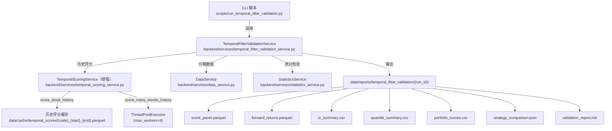
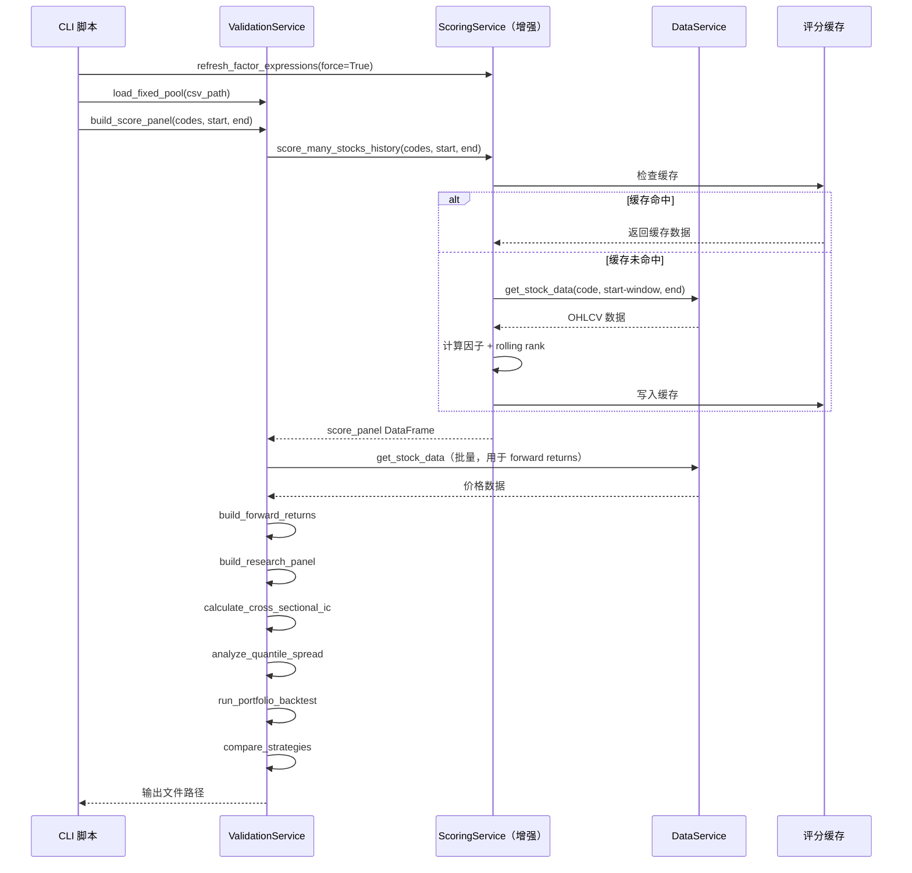

# 技术设计文档：时序筛选验证模块（temporal-filter-validation）

## 概述

本模块在现有 `temporal_scoring_service` 的基础上，新增一条"股票池筛选验证"主链：给定任意一组 100 支股票，使用时序评分引擎选出 Top10，通过横截面 IC 验证、分层收益验证、组合回测与统计显著性检验，量化评估 Top10 在未来收益和风险调整后收益上是否显著优于原始 100 支股票池。

本模块不修改打分公式，仅新增验证链路，不侵入现有回测主链。

---

## 架构

### 组件图



### 数据流

```
股票池 CSV
  → load_fixed_pool / load_snapshot_pool
  → build_score_panel（调用 score_many_stocks_history）
  → build_forward_returns（从 DataService 取价格，计算 t+1 起的未来收益）
  → build_research_panel（score + rank + forward_returns 合并）
  → calculate_cross_sectional_ic（横截面 Spearman IC）
  → analyze_quantile_spread（分层收益统计）
  → run_portfolio_backtest（4 组组合等权回测）
  → compare_strategies（配对 t 检验、信息比率）
  → 输出文件 + validation_report.md
```

---

## 改造一：增强 TemporalScoringService

**文件：** `backend/services/temporal_scoring_service.py`

### 新增方法

#### `refresh_factor_expressions(force: bool = False) -> None`

主动刷新预置因子表达式，避免服务启动时退回 fallback 后长期不恢复。

```python
def refresh_factor_expressions(self, force: bool = False) -> None:
    """
    刷新预置因子表达式。
    force=True 时强制重新加载；否则仅在距上次加载超过 1 小时时刷新。
    记录 last_refresh_at 时间戳和 factor_expression_source（'db' 或 'fallback'）。
    """
```

**行为：**
- 服务初始化时加载一次（已有）
- 批量历史验证开始前强制刷新一次
- 记录 `last_refresh_at: datetime` 和 `factor_expression_source: str`（`'db'` 或 `'fallback'`）
- DB 失败时明确标记 `factor_expression_source = 'fallback'`，不静默继续

#### `score_stock_history(code, start_date, end_date, window=252) -> pd.DataFrame`

一次性返回某只股票在整个历史区间内的每日评分序列，避免逐日重复取数。

```python
def score_stock_history(
    self,
    code: str,
    start_date: str,
    end_date: str,
    window: int = 252,
) -> pd.DataFrame:
    """
    计算单只股票在 [start_date, end_date] 区间内的每日评分序列。

    Returns:
        DataFrame，列：date, code, score, trend_break, high_volatility, liquidity_risk
        索引为 date（DatetimeIndex）

    Raises:
        ValueError: 数据不足（有效交易日 < window + 20）
    """
```

**实现要点：**
1. 拉取 `start_date - window 个自然日` 到 `end_date` 的全量价格数据（一次）
2. 一次计算完整因子时间序列（8 个因子）
3. 使用 rolling rank 向量化计算时序百分位，**避免未来函数**：
   ```python
   pct_series = factor_series.rolling(window=window, min_periods=20).rank(pct=True)
   ```
4. 向量化生成每日 score、trend_break、high_volatility、liquidity_risk
5. 只返回 `[start_date, end_date]` 区间内的行（预热期数据不输出）
6. 结果缓存到 `data/cache/temporal_scores/{code}_{start_date}_{end_date}.parquet`

#### `score_many_stocks_history(codes, start_date, end_date, max_workers=4) -> pd.DataFrame`

批量生成股票池的历史评分面板。

```python
def score_many_stocks_history(
    self,
    codes: list[str],
    start_date: str,
    end_date: str,
    max_workers: int = 4,
) -> pd.DataFrame:
    """
    批量生成历史评分面板。

    Returns:
        DataFrame，列：date, code, score, trend_break, high_volatility, liquidity_risk
        失败的股票记录到 errors 列表（不抛出异常）

    Side effects:
        self._last_history_errors: list[dict] 记录失败信息 {"code": ..., "error": ...}
    """
```

**实现要点：**
- 每只股票独立处理，用 `ThreadPoolExecutor(max_workers=max_workers)`
- 失败的股票记录到 `self._last_history_errors`，不中断整体
- 最后 `pd.concat` 所有成功结果

---

## 改造二：新增验证主服务

**文件：** `backend/services/temporal_filter_validation_service.py`

### 类结构

```python
class TemporalFilterValidationService:
    def __init__(self):
        self.scoring_service: TemporalScoringService
        self.data_service: DataService
        self.stats_service: StatisticsService
        self.output_base_dir: Path  # data/reports/temporal_filter_validation/
        self.score_cache_dir: Path  # data/cache/temporal_scores/
```

### 方法详细设计

#### `load_fixed_pool(csv_path) -> list[str]`

```python
def load_fixed_pool(self, csv_path: str) -> list[str]:
    """
    加载固定股票池 CSV（含 'code' 列）。
    返回去重后的股票代码列表。
    """
```

#### `load_snapshot_pool(csv_path) -> pd.DataFrame`

```python
def load_snapshot_pool(self, csv_path: str) -> pd.DataFrame:
    """
    加载历史快照股票池 CSV（含 'date', 'code' 列）。
    返回 DataFrame，date 列为 DatetimeIndex。
    """
```

#### `build_score_panel(codes, start_date, end_date) -> pd.DataFrame`

```python
def build_score_panel(
    self,
    codes: list[str],
    start_date: str,
    end_date: str,
) -> pd.DataFrame:
    """
    构建历史评分面板。

    Returns:
        DataFrame，列：date, code, score, rank, trend_break, high_volatility, liquidity_risk
        rank 为每个 date 截面内的 score 降序排名（1 = 最高分）
    """
```

**实现：**
- 调用 `scoring_service.score_many_stocks_history(codes, start_date, end_date)`
- 按 date 分组，计算截面内 score 的降序排名（`rank` 列）

#### `build_forward_returns(codes, start_date, end_date, horizons=(5,10,20)) -> pd.DataFrame`

```python
def build_forward_returns(
    self,
    codes: list[str],
    start_date: str,
    end_date: str,
    horizons: tuple[int, ...] = (5, 10, 20),
) -> pd.DataFrame:
    """
    构建未来收益面板。

    Returns:
        DataFrame，列：date, code, future_return_5, future_return_10, future_return_20
        未来收益定义：future_return_h = close[t+h] / open[t+1] - 1
        若 open 不可用则退化为：close[t+h] / close[t+1] - 1
    """
```

**防止未来函数：**
- `t` 日收盘后计算 score
- `t+1` 开始建仓（使用 `open[t+1]` 或 `close[t+1]`）
- `future_return_h = close[t+h] / entry_price - 1`

#### `build_research_panel(score_panel, forward_returns) -> pd.DataFrame`

```python
def build_research_panel(
    self,
    score_panel: pd.DataFrame,
    forward_returns: pd.DataFrame,
) -> pd.DataFrame:
    """
    合并评分面板与未来收益面板。

    Returns:
        DataFrame，列：date, code, score, rank, future_return_5, future_return_10, future_return_20
        按 (date, code) 内连接
    """
```

#### `calculate_cross_sectional_ic(panel, horizons=(5,10,20)) -> dict`

```python
def calculate_cross_sectional_ic(
    self,
    panel: pd.DataFrame,
    horizons: tuple[int, ...] = (5, 10, 20),
) -> dict:
    """
    计算横截面 IC。

    对每个调仓日 t，在当日股票池内计算：
        IC_h(t) = spearmanr(rank(score_t), future_return_h_t)

    Returns:
        {
            "ic_5":  {"ic_mean": ..., "ic_std": ..., "ir": ..., "positive_ratio": ..., "t_stat": ..., "p_value": ...},
            "ic_10": {...},
            "ic_20": {...},
        }
    """
```

**结论标准：** `IC_mean > 0` 且 `p < 0.05`

#### `analyze_quantile_spread(panel, n_quantiles=5, horizons=(5,10,20)) -> dict`

```python
def analyze_quantile_spread(
    self,
    panel: pd.DataFrame,
    n_quantiles: int = 5,
    horizons: tuple[int, ...] = (5, 10, 20),
) -> dict:
    """
    分层收益验证。

    对每个调仓日，按 score 将股票分成 n_quantiles 组，
    统计各组未来收益的均值、年化收益、Sharpe、胜率。

    Returns:
        {
            "horizon_5":  {"Q1": {...}, "Q2": {...}, ..., "Q5": {...}, "spread": {...}},
            "horizon_10": {...},
            "horizon_20": {...},
        }
        spread = Q1（最高分组）- Q5（最低分组）的收益差
    """
```

#### `run_portfolio_backtest(panel, top_n=10, rebalance='W-FRI', score_threshold=None) -> pd.DataFrame`

```python
def run_portfolio_backtest(
    self,
    panel: pd.DataFrame,
    top_n: int = 10,
    rebalance: str = "W-FRI",
    score_threshold: float | None = None,
) -> pd.DataFrame:
    """
    组合回测，同时输出 4 组策略的净值曲线。

    策略定义：
        A: universe100_eq   - 原始 100 支等权持有
        B: random10_avg     - 随机抽 10 支（seed=42，重复 20 次取均值）
        C: top10_score      - 评分最高前 10 支等权
        D: top10_score_threshold - score >= score_threshold 后取前 10 支，不足 10 支剩余权重留现金

    Returns:
        DataFrame，列：date, universe100_eq, random10_avg, top10_score, top10_score_threshold
        索引为调仓日期
    """
```

**实现要点：**
- 调仓频率默认 `W-FRI`（每周五）
- 等权再平衡：每次调仓时等权分配，持有到下次调仓
- 随机基准固定 `seed=42`，重复 20 次取均值，保证可复现
- 策略 D 不足 `top_n` 支时，剩余权重留现金（收益为 0）
- 不依赖 vectorbt，自行实现简单等权回测器

#### `compare_strategies(curves_or_returns) -> dict`

```python
def compare_strategies(
    self,
    curves_or_returns: pd.DataFrame,
) -> dict:
    """
    统计显著性检验与策略对比。

    Returns:
        {
            "metrics": {
                "universe100_eq":  {"annual_return": ..., "sharpe": ..., "max_drawdown": ..., "volatility": ..., "win_rate": ...},
                "random10_avg":    {...},
                "top10_score":     {...},
                "top10_score_threshold": {...},
            },
            "statistical_tests": {
                "top10_vs_universe100": {"paired_t_stat": ..., "p_value": ..., "significant": ..., "ir": ...},
                "top10_vs_random10":    {...},
            },
            "conclusion": "..."  # 可读结论文本
        }
    """
```

**检验方法：**
- 配对 t 检验（`scipy.stats.ttest_rel`）
- 信息比率（IR = 超额收益均值 / 超额收益标准差）
- 超额收益均值检验

---

## 改造三：CLI 脚本

**文件：** `scripts/run_temporal_filter_validation.py`

### 参数设计

```
--pool-csv          股票池 CSV 路径（必填）
--start-date        回测开始日期，格式 YYYY-MM-DD（必填）
--end-date          回测结束日期，格式 YYYY-MM-DD（必填）
--top-n             Top N 筛选数量，默认 10
--score-threshold   策略 D 的评分阈值，默认 None（不启用）
--rebalance         调仓频率，默认 W-FRI
--horizons          未来收益周期，逗号分隔，默认 5,10,20
--max-workers       并发线程数，默认 4
--output-dir        输出目录，默认 data/reports/temporal_filter_validation/
--n-quantiles       分层数量，默认 5
```

### 执行流程

```
1. 解析参数
2. 调用 temporal_scoring_service.refresh_factor_expressions(force=True)
3. 记录 factor_expression_source 到报告
4. 调用 validation_service.load_fixed_pool(pool_csv)
5. 调用 validation_service.build_score_panel(...)
6. 调用 validation_service.build_forward_returns(...)
7. 调用 validation_service.build_research_panel(...)
8. 调用 validation_service.calculate_cross_sectional_ic(...)
9. 调用 validation_service.analyze_quantile_spread(...)
10. 调用 validation_service.run_portfolio_backtest(...)
11. 调用 validation_service.compare_strategies(...)
12. 输出所有文件到 {output_dir}/{run_id}/
13. 生成 validation_report.md
```

### 示例

```bash
.venv/bin/python scripts/run_temporal_filter_validation.py \
  --pool-csv tests/pool100.csv \
  --start-date 2024-01-01 \
  --end-date 2026-03-20 \
  --top-n 10 \
  --score-threshold 70 \
  --rebalance W-FRI \
  --horizons 5,10,20
```

---

## 数据模型

### 输入格式

**固定股票池（Phase 1）：**
```csv
code
600519
000001
300750
```

**历史快照股票池（Phase 2）：**
```csv
date,code
2025-01-03,600519
2025-01-03,000001
2025-01-10,600519
```

### 输出文件结构

```
data/reports/temporal_filter_validation/{run_id}/
├── score_panel.parquet          # date, code, score, rank, trend_break, high_volatility, liquidity_risk
├── forward_returns.parquet      # date, code, future_return_5, future_return_10, future_return_20
├── ic_summary.csv               # horizon, ic_mean, ic_std, ir, positive_ratio, t_stat, p_value
├── quantile_summary.csv         # horizon, quantile, mean_return, annual_return, sharpe, win_rate, sample_count
├── portfolio_curves.csv         # date, universe100_eq, random10_avg, top10_score, top10_score_threshold
├── strategy_comparison.json     # 组合对比与统计显著性结果
├── scoring_errors.csv           # code, error（打分失败的股票记录，停牌/数据不足/因子NaN等）
└── validation_report.md         # 可读结论报告
```

### 历史评分缓存

```
data/cache/temporal_scores/{code}_{start_date}_{end_date}.parquet
```

缓存命中条件：因子定义未变 + 时间范围未变。

---

## 关键算法

### Rolling Rank 时序百分位（防未来函数）

```python
# 向量化计算，避免逐日 percentileofscore 暴力循环
pct_series = factor_series.rolling(window=252, min_periods=20).rank(pct=True)
```

含义：每个日期的当前值，在过去 252 个观测中的分位位置。

### 未来收益计算

```python
# t 日收盘后计算 score，t+1 开始建仓
entry_price = open_series.shift(-1)          # open[t+1]
if entry_price.isna().all():
    entry_price = close_series.shift(-1)     # 退化为 close[t+1]

for h in horizons:
    future_return = close_series.shift(-h) / entry_price - 1
```

### 等权回测器

```python
# 每个调仓日等权分配，持有到下次调仓
def _equal_weight_backtest(holdings_by_date, price_data):
    """
    holdings_by_date: {date: [code1, code2, ...]}
    返回每日净值序列
    """
```

### 横截面 IC

```python
# 每个调仓日，在截面内计算 Spearman 相关
for date, group in panel.groupby("date"):
    ic, _ = spearmanr(group["score"].rank(), group[f"future_return_{h}"])
    ic_series.append(ic)
```

---

## 序列图

### 完整验证流程



---

## 错误处理策略

| 层级 | 错误类型 | 处理方式 |
|------|---------|---------|
| 单只股票历史评分 | 数据不足、因子计算失败 | 记录到 `_last_history_errors`，继续处理其余股票 |
| 未来收益计算 | 价格数据缺失 | 对应行填 NaN，IC/分层计算时 dropna |
| 因子表达式加载 | DB 连接失败 | 使用 fallback，在报告中明确标记 `factor_expression_source=fallback` |
| 输出目录 | 磁盘空间不足 | 抛出异常，CLI 打印错误信息 |
| 统计检验 | 样本量不足（< 30） | 跳过该检验，在报告中注明 |

---

## 测试策略

### 单元测试重点

- `load_fixed_pool`：CSV 格式正确/缺列/空文件
- `build_forward_returns`：未来收益从 `t+1` 开始，不含 `t` 日数据
- `run_portfolio_backtest`：策略 D 不足 10 支时现金权重正确
- `calculate_cross_sectional_ic`：IC 输出格式含所有 horizon 维度
- `compare_strategies`：p 值在 [0, 1] 范围内

### 属性测试重点

使用 **Hypothesis** 库：

| 属性 | 描述 | 生成策略 |
|------|------|---------|
| 无未来函数 | `t` 日评分只使用 `t` 及以前数据 | 构造含未来数据的序列，验证 rolling rank 不使用未来 |
| Top10 权重守恒 | 每次调仓总权重 = 1（策略 C）| 随机生成评分面板，验证权重之和 |
| 策略 D 现金权重 | 不足 top_n 支时，现金权重 = 1 - 持仓权重之和 | 随机生成少于 top_n 支的评分面板 |
| IC 输出完整性 | 输出包含所有 horizon 维度，p 值在 [0,1] | 随机生成 research panel |

### 集成测试

- 固定 5 支股票小池跑通完整链路（快速验证）
- 验证输出文件均存在且格式正确
- 验证 `portfolio_curves.csv` 的日期范围与输入一致

---

## 分阶段实施

### Phase 1（本次）：固定池验证

- 固定股票池输入
- 历史评分面板（含缓存）
- forward returns（5/10/20 日）
- 横截面 IC
- 分层收益
- 4 组组合回测
- 统计显著性报告

### Phase 2：历史快照股票池

- `load_snapshot_pool` 支持 `date, code` 格式
- 每个调仓日使用对应的股票池

### Phase 3：API 化

- `backend/api/routers/validation.py`
- 异步任务接口 + 结果查询接口

---

## 正确性属性

### 属性 1：无未来函数

对任意股票的历史评分序列，`t` 日的 score 只能使用 `t` 及以前的价格数据。

**验证：** `score_stock_history` 使用 `rolling(window, min_periods=20).rank(pct=True)`，窗口仅向后看。

### 属性 2：未来收益从 t+1 开始

对任意 `(code, date)` 对，`future_return_h` 的计算起点为 `date + 1` 个交易日的开盘价（或收盘价），不使用 `date` 当日数据。

**验证：** `build_forward_returns` 中 `entry_price = open_series.shift(-1)`。

### 属性 3：Top10 权重守恒

对任意调仓日，策略 C（top10_score）的持仓权重之和恒等于 1。

**验证：** 等权分配，`weight = 1 / len(holdings)`，`sum(weights) == 1`。

### 属性 4：策略 D 现金权重正确

对任意调仓日，策略 D 的持仓权重之和 ≤ 1，现金权重 = `1 - sum(stock_weights)`，且 `sum(all_weights) == 1`。

**验证：** 不足 `top_n` 支时，`weight = 1 / top_n`，剩余为现金。

### 属性 5：IC 输出完整性

对任意合法的 research panel，`calculate_cross_sectional_ic` 的输出包含所有请求的 horizon 维度，每个维度包含 `ic_mean`、`ic_std`、`ir`、`positive_ratio`、`t_stat`、`p_value` 六个字段，且 `p_value ∈ [0, 1]`。

**验证：** 使用 Hypothesis 生成随机 panel。

### 属性 6：随机基准可复现

对相同的股票池和调仓日，使用 `seed=42` 的随机基准（策略 B）在多次运行中产生完全相同的结果。

**验证：** 两次调用 `run_portfolio_backtest` 结果一致。

### 属性 7：评分缓存一致性

对相同的 `(code, start_date, end_date)`，从缓存读取的评分序列与重新计算的评分序列完全一致。

**验证：** 删除缓存后重新计算，对比结果。

### 属性 8：失败样本记录完整

对任意批量历史评分任务，`len(成功结果) + len(失败记录) == len(输入股票池)`。

**验证：** mock 部分股票抛出异常，验证总数守恒。
