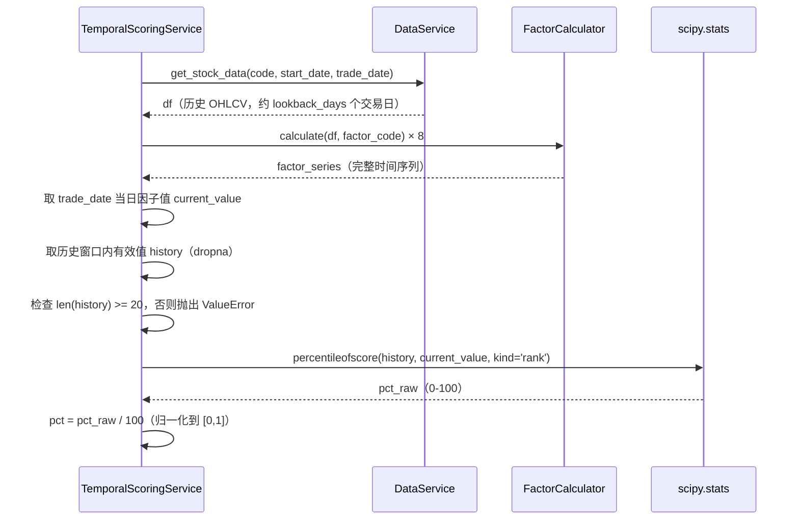
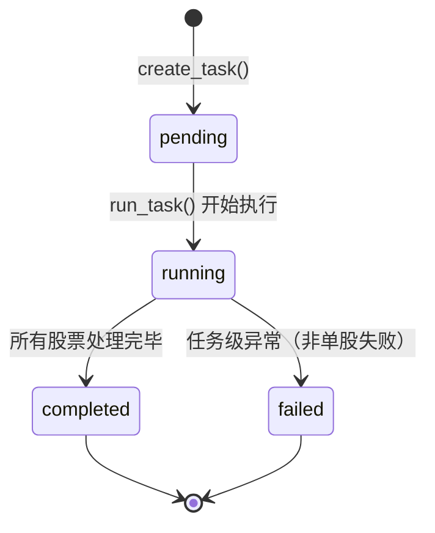

# 技术设计文档：日频时序打分模块（temporal-scoring）

## 概述

本模块为 FactorHub 新增日频时序打分能力。输入股票代码列表与交易日期，系统计算 8 个固定技术因子，通过时序百分位归一化后加权合成综合评分（0-100 分），并以 CSV 文件形式落盘输出。

小批量（≤20 只）请求同步返回；大批量（>20 只）请求异步执行，通过 task_id 轮询进度与结果。

**设计原则：**
- 不侵入现有回测主链，仅新增文件与配置
- 复用 `data_service.py` 的数据获取能力和 `factor_service.py` 的 `FactorCalculator`
- 异步任务结果边计算边落盘，支持中途查询部分结果

---

## 架构

### 组件图

```mermaid
graph TD
    Client["客户端"] -->|POST /api/scoring/temporal-score| Router["Scoring_Router\n(scoring.py)"]
    Client -->|POST /api/scoring/temporal-score/jobs| Router
    Client -->|GET /api/scoring/temporal-score/jobs/{task_id}| Router
    Client -->|GET /api/scoring/temporal-score/jobs/{task_id}/results| Router

    Router -->|≤20只，同步| ScoringService["TemporalScoringService\n(temporal_scoring_service.py)"]
    Router -->|>20只，异步| TaskManager["TaskManager\n(temporal_scoring_service.py)"]

    TaskManager -->|提交后台任务| ThreadPool["ThreadPoolExecutor\n(max_workers=4)"]
    ThreadPool -->|并发调用| ScoringService

    ScoringService -->|获取历史数据| DataService["data_service.py\n(DataService)"]
    ScoringService -->|计算因子值| FactorCalculator["factor_service.py\n(FactorCalculator)"]
    ScoringService -->|百分位归一化| Scipy["scipy.stats.percentileofscore"]

    TaskManager -->|读写| FileSystem["文件系统\ndata/reports/scoring_jobs/{task_id}/"]
    FileSystem --> StatusJSON["status.json"]
    FileSystem --> DailyScores["daily_scores.csv"]
    FileSystem --> DailyScoresDetail["daily_scores_detail.csv"]
    FileSystem --> InputCodes["input_codes.csv"]
    FileSystem --> ErrorsCSV["errors.csv"]
```

### 数据流

**同步评分流程：**
```
POST /api/scoring/temporal-score
  → Router 验证请求（codes ≤ 20）
  → ScoringService.score_many_stocks(codes, trade_date)
    → 对每只股票调用 score_one_stock(code, trade_date)
      → DataService.get_stock_data(code, start_date, trade_date)
      → FactorCalculator.calculate(df, factor_code) × 8
      → percentileofscore(history, current_value) × 8
      → 计算 raw_score → 计算惩罚项 → clip → score
  → 返回 {"success": true, "data": [...], "errors": [...]}
```

**异步评分流程：**
```
POST /api/scoring/temporal-score/jobs
  → Router 验证请求（codes > 20）
  → TaskManager.create_task(codes, trade_date) → task_id
    → 创建目录结构，写入 input_codes.csv，写入初始 status.json
  → 返回 202 {"task_id": "...", "status": "pending"}
  → BackgroundTasks 触发 TaskManager.run_task(task_id, codes, trade_date)
    → 更新 status.json: status=running, started_at=now
    → ThreadPoolExecutor 并发处理每只股票
      → 成功：追加写入 daily_scores.csv + daily_scores_detail.csv
      → 失败：追加写入 errors.csv
      → 每只完成后更新 status.json（processed, progress, updated_at）
    → 全部完成：更新 status.json: status=completed, completed_at=now
```

---

## 模块设计

### TemporalScoringService

**文件：** `backend/services/temporal_scoring_service.py`

**职责：** 单只股票的因子计算、百分位归一化与评分合成。

```python
class TemporalScoringService:
    def __init__(self):
        self.calculator: FactorCalculator  # 复用 factor_service.factor_service.calculator
        self.lookback_days: int            # settings.SCORING_LOOKBACK_DAYS

    def score_one_stock(self, code: str, trade_date: str) -> dict:
        """
        计算单只股票在指定交易日的评分。

        Args:
            code: 股票代码，如 "600519"
            trade_date: 交易日期，格式 "YYYY-MM-DD"

        Returns:
            {
                "date": "2026-03-20",
                "code": "600519",
                "score": 78.4,
                "factors": {"price_vs_sma20": 1.023, ...},  # 8个因子原始值
                "pcts": {"price_vs_sma20": 0.72, ...}       # 8个因子百分位
            }

        Raises:
            ValueError: 数据不足（有效数据点 < 20）或因子计算失败
        """

    def score_many_stocks(self, codes: list[str], trade_date: str) -> tuple[list[dict], list[dict]]:
        """
        同步批量评分（供同步接口调用）。

        Returns:
            (results, errors)
            results: [{"date": ..., "code": ..., "score": ...}, ...]
            errors:  [{"code": ..., "error": ...}, ...]
        """

    def _get_history_data(self, code: str, trade_date: str) -> pd.DataFrame:
        """获取截至 trade_date 的 lookback_days 历史数据"""

    def _compute_factors(self, df: pd.DataFrame) -> dict[str, pd.Series]:
        """计算 8 个固定因子，返回各因子的完整时间序列"""

    def _compute_percentile(self, series: pd.Series, current_value: float) -> float:
        """
        使用 scipy.stats.percentileofscore(kind='rank') 计算百分位。
        有效数据点 < 20 时抛出 ValueError。
        返回值归一化到 [0, 1]。
        """

    def _compute_score(self, pcts: dict[str, float]) -> float:
        """根据百分位字典计算最终 score（含惩罚项，clip 到 [0, 100]）"""
```

### TaskManager

**文件：** `backend/services/temporal_scoring_service.py`（与 TemporalScoringService 同文件）

**职责：** 异步任务的生命周期管理、并发控制、文件落盘。

```python
class TaskManager:
    def __init__(self):
        self.scoring_service: TemporalScoringService
        self.results_dir: Path              # settings.SCORING_RESULTS_DIR
        self.max_workers: int               # settings.SCORING_MAX_WORKERS
        self._executor: ThreadPoolExecutor  # 延迟初始化

    def create_task(self, codes: list[str], trade_date: str) -> str:
        """
        创建任务目录结构，写入 input_codes.csv 和初始 status.json。
        返回 task_id（UUID）。
        """

    def run_task(self, task_id: str, codes: list[str], trade_date: str) -> None:
        """
        后台执行任务（由 FastAPI BackgroundTasks 调用）。
        使用 ThreadPoolExecutor 并发处理每只股票。
        每只股票完成后立即落盘，不缓存在内存。
        """

    def get_status(self, task_id: str) -> dict:
        """读取并返回 status.json 内容。task_id 不存在时抛出 FileNotFoundError。"""

    def get_results(self, task_id: str, detail: bool = False) -> list[dict]:
        """
        读取 daily_scores.csv（detail=False）或 daily_scores_detail.csv（detail=True）。
        任务未完成时抛出 ValueError。
        """

    def _task_dir(self, task_id: str) -> Path:
        """返回任务目录路径"""

    def _write_status(self, task_id: str, status: dict) -> None:
        """原子写入 status.json（写临时文件后 rename）"""

    def _append_score_row(self, task_id: str, result: dict) -> None:
        """追加写入 daily_scores.csv 和 daily_scores_detail.csv"""

    def _append_error_row(self, task_id: str, code: str, error: str) -> None:
        """追加写入 errors.csv"""
```

### Scoring_Router

**文件：** `backend/api/routers/scoring.py`

**职责：** HTTP 接口定义、同步/异步分发、请求验证、响应格式化。

```python
router = APIRouter()

@router.post("/temporal-score")
async def sync_score(request: ScoringRequest) -> SyncScoringResponse:
    """同步评分（codes ≤ SCORING_SYNC_THRESHOLD）"""

@router.post("/temporal-score/jobs", status_code=202)
async def async_score(request: ScoringRequest, background_tasks: BackgroundTasks) -> AsyncJobResponse:
    """异步任务创建（codes > SCORING_SYNC_THRESHOLD）"""

@router.get("/temporal-score/jobs/{task_id}")
async def get_job_status(task_id: str) -> dict:
    """任务状态查询"""

@router.get("/temporal-score/jobs/{task_id}/results")
async def get_job_results(task_id: str, detail: bool = False) -> dict:
    """任务结果查询，支持 ?detail=true"""
```

---

## 数据模型

### 请求/响应 Schema（Pydantic）

```python
class ScoringRequest(BaseModel):
    codes: list[str]                    # 股票代码列表，不可为空
    trade_date: Optional[str] = None    # 格式 "YYYY-MM-DD"，缺省时使用最新交易日

class ScoreItem(BaseModel):
    date: str
    code: str
    score: float                        # 保留 1 位小数

class SyncScoringResponse(BaseModel):
    success: bool
    data: list[ScoreItem]
    errors: list[dict]                  # [{"code": "...", "error": "..."}]

class AsyncJobResponse(BaseModel):
    task_id: str
    status: str                         # "pending"

class JobStatus(BaseModel):
    task_id: str
    status: str                         # pending | running | completed | failed
    trade_date: str
    total: int
    processed: int
    success_count: int
    failed_count: int
    progress: float                     # processed / total * 100，保留 1 位小数
    started_at: Optional[str]           # ISO8601
    updated_at: Optional[str]           # ISO8601
    completed_at: Optional[str]         # ISO8601
```

### 文件格式

**任务目录结构：**
```
data/reports/scoring_jobs/{task_id}/
├── input_codes.csv          # 每行一个股票代码（无表头）
├── status.json              # 任务状态（见 JobStatus）
├── daily_scores.csv         # date,code,score（score 保留 1 位小数）
├── daily_scores_detail.csv  # 8 因子原始值 + 百分位值（见下方列定义）
└── errors.csv               # code,error
```

**daily_scores.csv 列定义：**
```
date,code,score
2026-03-20,600519,78.4
2026-03-20,000001,62.1
```

**daily_scores_detail.csv 列定义：**
```
date,code,score,
price_vs_sma20,momentum_20,price_vwma_ratio,force_index_ma,bollinger_position,stochastic_d,atr_norm,volume_ma_ratio,
pct_price_vs_sma20,pct_momentum_20,pct_price_vwma_ratio,pct_force_index_ma,pct_bollinger_position,pct_stochastic_d,pct_atr_norm,pct_volume_ma_ratio
```

**status.json 结构：**
```json
{
  "task_id": "550e8400-e29b-41d4-a716-446655440000",
  "status": "running",
  "trade_date": "2026-03-20",
  "total": 200,
  "processed": 87,
  "success_count": 84,
  "failed_count": 3,
  "progress": 43.5,
  "started_at": "2026-03-20T09:00:00+08:00",
  "updated_at": "2026-03-20T09:05:23+08:00",
  "completed_at": null
}
```

### 8 个固定因子定义

| 因子名 | 计算表达式 | 说明 |
|--------|-----------|------|
| `price_vs_sma20` | `close / SMA(close, 20)` | 价格相对 20 日均线位置 |
| `momentum_20` | `close / close.shift(20) - 1` | 20 日动量 |
| `price_vwma_ratio` | `close / (sum(close*volume, 20) / sum(volume, 20))` | 价格相对成交量加权均价 |
| `force_index_ma` | `SMA(close.diff(1) * volume, 13)` | 力量指数均线 |
| `bollinger_position` | `(close - lower) / (upper - lower)` | 布林带相对位置 |
| `stochastic_d` | `SMA(stochastic_k, 3)` | 随机指标 D 值 |
| `atr_norm` | `ATR(14) / close` | 归一化 ATR（波动率） |
| `volume_ma_ratio` | `volume / SMA(volume, 10)` | 量能比 |

> 注：`price_vs_sma20`、`bollinger_position`、`stochastic_d` 已在 `factor_service.py` 的预置因子中定义，可直接复用其表达式。`price_vwma_ratio`、`force_index_ma` 需在 `TemporalScoringService` 内部实现。

---

## 关键流程

### 评分公式

```python
# 加权合成原始分（仅使用 6 个趋势/动量因子）
raw_score = 100 * (
    0.22 * pct("price_vs_sma20") +
    0.18 * pct("momentum_20") +
    0.16 * pct("price_vwma_ratio") +
    0.14 * pct("force_index_ma") +
    0.14 * pct("bollinger_position") +
    0.16 * pct("stochastic_d")
)

# 惩罚项（atr_norm 和 volume_ma_ratio 仅用于惩罚）
trend_break    = 1 if pct("price_vs_sma20") < 0.35 or pct("stochastic_d") < 0.20 else 0
high_volatility = 1 if pct("atr_norm") > 0.80 else 0
liquidity_risk  = 1 if pct("volume_ma_ratio") < 0.30 else 0

score = clip(raw_score - 12*trend_break - 10*high_volatility - 8*liquidity_risk, 0, 100)
```

### 百分位计算流程



**start_date 计算：**
```python
from datetime import datetime, timedelta
trade_date_dt = datetime.strptime(trade_date, "%Y-%m-%d")
start_date = (trade_date_dt - timedelta(days=lookback_days)).strftime("%Y-%m-%d")
```

### 异步任务状态机



---

## 正确性属性

*属性（Property）是在系统所有有效执行中都应成立的特征或行为——本质上是对系统应做什么的形式化陈述。属性是人类可读规范与机器可验证正确性保证之间的桥梁。*

### 属性 1：同步评分结果完整性

*对任意* 长度在 [1, 20] 之间的有效股票代码列表，同步评分接口返回的 `data` 数组中每条记录的 `date` 字段应与请求的 `trade_date` 一致。

**验证：需求 1.1、1.3**

### 属性 2：错误隔离不中断

*对任意* 包含部分无效股票代码的请求，无效股票应出现在 `errors` 字段中，有效股票的评分结果应仍然出现在 `data` 字段中，两者之和等于请求的 `codes` 总数。

**验证：需求 1.4、7.2、7.3**

### 属性 3：异步任务创建返回 202

*对任意* 长度大于 20 的股票代码列表，异步任务创建接口应返回 HTTP 202，响应体包含有效的 `task_id`（UUID 格式）和 `status="pending"`。

**验证：需求 2.1**

### 属性 4：input_codes.csv 与请求一致（Round-Trip）

*对任意* 异步任务，任务创建后读取 `input_codes.csv` 的内容，应与请求的 `codes` 列表完全一致（顺序可不同，但集合相同）。

**验证：需求 2.2**

### 属性 5：状态字段完整性与 progress 计算正确性

*对任意* 处于任意状态的任务，状态查询接口返回的 JSON 应包含所有必需字段（`task_id`、`status`、`trade_date`、`total`、`processed`、`success_count`、`failed_count`、`progress`、`started_at`、`updated_at`），且 `progress = round(processed / total * 100, 1)`。

**验证：需求 3.1、3.5**

### 属性 6：评分公式正确性

*对任意* 8 个因子的百分位值组合（每个值在 [0, 1] 之间），`_compute_score` 方法的输出应满足：
- 等于 `clip(raw_score - 12*trend_break - 10*high_volatility - 8*liquidity_risk, 0, 100)`
- 结果始终在 [0, 100] 范围内

**验证：需求 5.3、5.4**

### 属性 7：百分位正确性（范围 + 单调性）

*对任意* 长度 ≥ 20 的因子时间序列，`_compute_percentile` 方法的输出应满足：
- 结果始终在 [0, 1] 范围内（不变量）
- 对同一历史窗口，较大的因子值对应不小于较小因子值的百分位（单调性）

**验证：需求 6.1、6.4**

### 属性 8：结果文件格式正确性

*对任意* 完成的任务，`daily_scores.csv` 应满足：首行为表头 `date,code,score`，每行 `score` 值保留 1 位小数，行数等于 `success_count`。

**验证：需求 8.5、9.2**

### 属性 9：详细结果包含所有因子字段

*对任意* 完成的任务，使用 `detail=true` 查询结果时，返回的每条记录应包含 8 个因子的原始值字段和 8 个百分位值字段（共 16 个因子相关字段）。

**验证：需求 4.4**

---

## 错误处理策略

### 分层错误处理

| 层级 | 错误类型 | 处理方式 |
|------|---------|---------|
| 单只股票 | 数据获取失败、因子计算失败、数据不足 | 捕获异常，写入 `errors.csv`，继续处理其余股票 |
| 批量任务 | ThreadPoolExecutor 内部异常 | 每个 Future 独立捕获，不传播到任务级别 |
| 任务级别 | 目录创建失败、status.json 写入失败 | 更新 `status=failed`，记录错误信息 |
| API 层 | task_id 不存在 | 返回 HTTP 404 |
| API 层 | 任务未完成时查询结果 | 返回 HTTP 400 |
| API 层 | 任务创建异常 | 返回 HTTP 500 |

### 具体异常场景

**数据不足异常：**
```python
if len(valid_history) < 20:
    raise ValueError(f"股票 {code} 历史数据不足：有效数据点 {len(valid_history)} < 20")
```

**status.json 原子写入（防止并发读到半写文件）：**
```python
tmp_path = status_path.with_suffix(".tmp")
tmp_path.write_text(json.dumps(status, ensure_ascii=False, indent=2))
tmp_path.rename(status_path)  # 原子操作
```

**并发写文件（追加写入需加锁）：**
```python
# TaskManager 内部维护每个 task_id 的文件锁
self._file_locks: dict[str, threading.Lock] = {}
```

---

## 测试策略

### 双轨测试方法

本模块采用单元测试与属性测试相结合的方式，两者互补：
- **单元测试**：验证具体示例、边界情况、错误条件
- **属性测试**：验证对所有输入都成立的普遍属性

### 单元测试重点

- `trade_date` 缺省时使用最新交易日（需求 1.2）
- 任务状态从 `pending → running → completed` 的完整流转（需求 2.3、3.3）
- `task_id` 不存在时返回 404（需求 3.4）
- 任务未完成时查询结果返回 400（需求 4.2）
- 数据点 < 20 时抛出异常（需求 6.2）
- 配置项默认值正确（需求 10.1）
- 10 只 / 50 只 / 200 只三档验收测试

### 属性测试重点

使用 **Hypothesis** 库（Python 属性测试框架），每个属性测试最少运行 100 次。

每个属性测试需在注释中标注对应的设计属性：
```python
# Feature: temporal-scoring, Property 6: 评分公式正确性
@given(pcts=st.fixed_dictionaries({
    "price_vs_sma20": st.floats(0, 1),
    ...
}))
@settings(max_examples=200)
def test_score_formula_correctness(pcts):
    ...
```

| 属性 | 测试方法 | 生成策略 |
|------|---------|---------|
| 属性 1：同步结果完整性 | 生成随机 codes 列表（长度 1-20），mock DataService | `st.lists(st.text(), min_size=1, max_size=20)` |
| 属性 2：错误隔离 | 混入无效 codes，验证 errors + data 总数 = 请求总数 | `st.lists` + 部分无效代码 |
| 属性 6：评分公式 | 生成随机百分位组合，验证公式计算结果 | `st.floats(0, 1)` × 8 |
| 属性 7：百分位正确性 | 生成随机因子时间序列（长度 ≥ 20），验证范围和单调性 | `st.lists(st.floats(), min_size=20)` |
| 属性 8：文件格式 | 生成随机评分结果，写入文件后读取验证 | `st.lists(ScoreItem)` |

### 验收测试（集成）

| 场景 | 股票数量 | 预期行为 |
|------|---------|---------|
| 小批量同步 | 10 只 | 同步返回，响应时间 < 30s |
| 中批量异步 | 50 只 | 202 响应，任务在 5 分钟内完成 |
| 大批量异步 | 200 只 | 202 响应，增量落盘可中途查询 |
