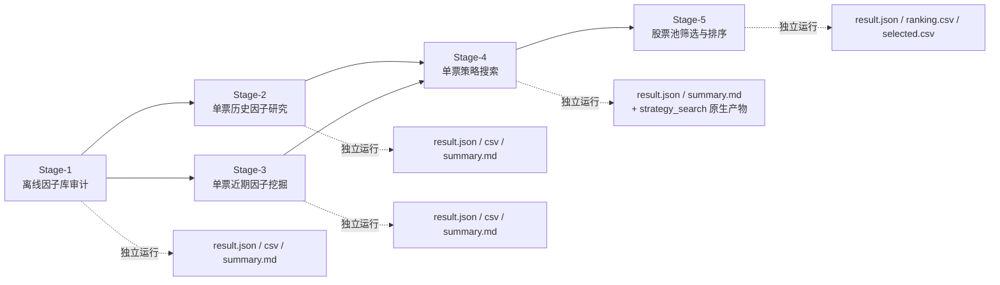

# FactorHub 正式 Pipeline 设计

## 1. 设计目标

本设计把当前仓库里的能力整理成 5 个**相互独立、可单独运行、输入输出明确**的 stage。

设计原则：

- 每个 stage 都有独立 `main`
- 每个 stage 都能单独评估，不强依赖上一 stage 必须先执行
- 允许 stage 之间复用产物，但不强绑定运行顺序
- 输出统一落盘，便于人工检查与脚本化评估


## 2. 总体结构



说明：

- Stage-1 解决“库里有没有足够完整的时序因子覆盖”
- Stage-2 解决“某只股票历史上哪些因子真正长期有效”
- Stage-3 解决“某只股票当前阶段哪些因子最近更可用”
- Stage-4 解决“针对某只股票应当采用哪套策略配置”
- Stage-5 解决“对一个股票池如何复用单股逻辑完成筛选排序”


## 3. 模块清单

| Stage | 目标 | 服务模块 | 独立入口 |
| --- | --- | --- | --- |
| Stage-1 | 离线审计因子覆盖与 baseline 因子集 | `backend/services/factor_library_audit_service.py` | `scripts/run_factor_library_audit.py` |
| Stage-2 | 单票历史因子研究 | `backend/services/single_stock_factor_research_service.py` | `scripts/run_single_stock_factor_research.py` |
| Stage-3 | 单票近期因子挖掘 | `backend/services/recent_factor_mining_service.py` | `scripts/run_single_stock_recent_factor_mining.py` |
| Stage-4 | 单票策略搜索与评分 | `backend/services/champion_strategy_service.py` | `scripts/run_single_stock_strategy_search.py` |
| Stage-5 | 股票池筛选与排序 | `backend/services/temporal_pool_service.py` + `backend/services/champion_strategy_service.py` | `scripts/run_stock_pool_screening.py` |


## 4. 各 Stage 输入输出

### 4.1 Stage-1 离线因子库审计

目标：

- 检查当前启用因子是否覆盖趋势、动量、反转、波动率、量价资金流、价格位置、风险、形态/状态等核心域
- 输出 baseline 因子种子集合，供 Stage-2/3/4 参考

输入：

- `search_space_id`
- `active_only`

输出：

- `result.json`
- `factor_inventory.csv`
- `domain_coverage.csv`
- `category_coverage.csv`
- `baseline_selected_factors.csv`
- `summary.md`


### 4.2 Stage-2 单票历史因子研究

目标：

- 在较长历史窗口上评估单只股票的有效因子
- 输出历史层面更稳定的因子排名

输入：

- `stock`
- `start_date`
- `end_date`
- `horizons`
- `lookback_days`
- `top`
- `min_samples`
- `corr_threshold`
- 可选 `factors`

输出：

- `result.json`
- `top_factors.csv`
- `all_factor_scores.csv`
- `summary.md`

核心字段：

- `historical_score`
- `recommended_direction`
- `abs_ic_mean`
- `abs_ir`
- `sign_consistency`
- `selected`


### 4.3 Stage-3 单票近期因子挖掘

目标：

- 在最近窗口内找出当前阶段更可用的因子
- 输出当前 `regime` 下的单票近期因子榜单

输入：

- `stock`
- `end_date`
- `eval_days`
- `lookback_days`
- `horizons`
- `top`
- `min_samples`
- `corr_threshold`

输出：

- `result.json`
- `top_factors.csv`
- `single_stock_top_factors.csv`
- `summary.md`

核心字段：

- `current_regime`
- `stock_score`
- `recommended_direction`
- `abs_ic_mean`
- `abs_ir`


### 4.4 Stage-4 单票策略搜索与评分

目标：

- 对单只股票运行完整候选策略搜索
- 选出一个可复用的 `champion profile`

输入：

- `stock`
- `start_date`
- `end_date`
- `search_space_id`

输出：

- `result.json`
- `summary.md`
- 原生搜索产物目录：`data/reports/strategy_search/<task_id>/`

核心字段：

- `profile_id`
- `stability_score`
- `metrics`
- `report_path`


### 4.5 Stage-5 股票池筛选与排序

目标：

- 使用同一套 `profile` 或 `pool champion` 对股票池统一打分
- 输出排序结果与最终筛选结果

输入：

- `trade_date`
- `pool_csv` 或 `stocks`
- `top_n`
- `score_threshold`
- 二选一：
  - `profile_id`
  - `search_space_id + search_start + search_end`

输出：

- `result.json`
- `ranking.csv`
- `selected.csv`
- `summary.md`

关键约束：

- 股票池横向比较时，必须尽量使用**同一套 profile 口径**
- 不建议让每只股票使用各自不同的 profile 后再直接横向比较分数


## 5. 独立运行方式

### Stage-1

```bash
python scripts/run_factor_library_audit.py
```

### Stage-2

```bash
python scripts/run_single_stock_factor_research.py \
  --stock 600519 \
  --start-date 2021-01-01 \
  --end-date 2026-03-20
```

### Stage-3

```bash
python scripts/run_single_stock_recent_factor_mining.py \
  --stock 600519 \
  --end-date 2026-03-20
```

### Stage-4

```bash
python scripts/run_single_stock_strategy_search.py \
  --stock 600519 \
  --start-date 2022-01-01 \
  --end-date 2026-03-20
```

### Stage-5

使用固定 profile：

```bash
python scripts/run_stock_pool_screening.py \
  --pool-csv tests/pool100.csv \
  --trade-date 2026-03-20 \
  --profile-id momentum_v1
```

先搜索 pool champion 再筛选：

```bash
python scripts/run_stock_pool_screening.py \
  --pool-csv tests/pool100.csv \
  --trade-date 2026-03-20 \
  --search-space-id temporal_default \
  --search-start 2022-01-01 \
  --search-end 2026-03-20
```


## 6. 产物规范

每个 stage 默认都落盘到 `data/pipeline_runs/<stage_name>/...`。

统一规范：

- `result.json`
  - 完整结构化结果
- `*.csv`
  - 便于人工快速检查和二次处理
- `summary.md`
  - 便于你直接打开看结论


## 7. 当前推荐使用顺序

推荐顺序：

1. `Stage-1` 看因子库覆盖够不够
2. `Stage-2` 看某只股票长期历史上哪些因子更稳定
3. `Stage-3` 看该股票最近窗口和当前状态下哪些因子更激活
4. `Stage-4` 搜索该股票的冠军策略
5. `Stage-5` 用统一策略口径去做股票池排序

但实现上不强制这个顺序，所有 stage 都支持单独跑。


## 8. 后续建议

下一步若继续增强，建议优先做这三件事：

1. 把 Stage-2/3 的输出直接转成 Stage-4 的候选 profile seed
2. 给 Stage-5 增加“多策略 ensemble 排名”，但必须先做同尺度归一化
3. 把各 stage 的 `run_manifest`、数据覆盖率、失败原因统一进 `result.json`
