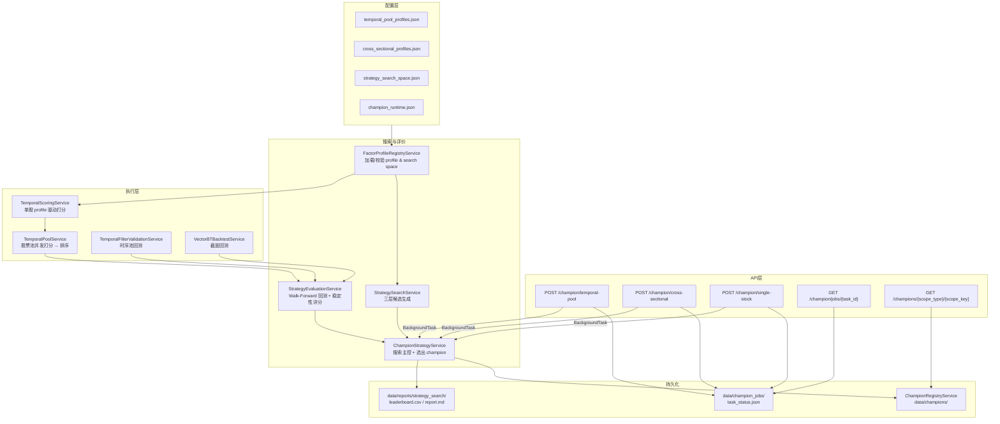
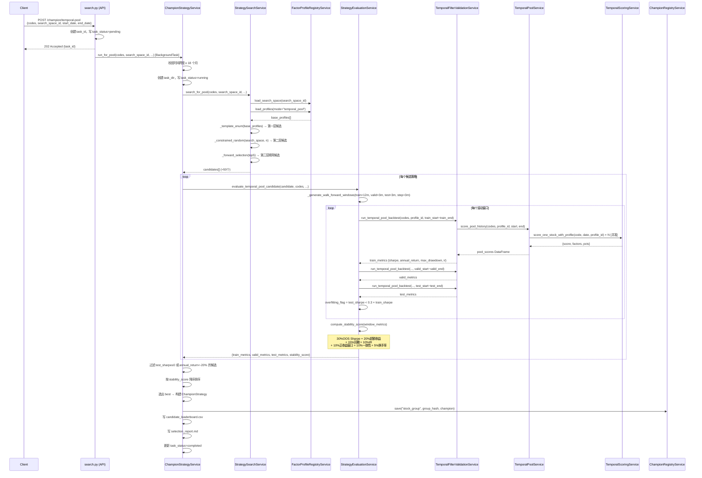
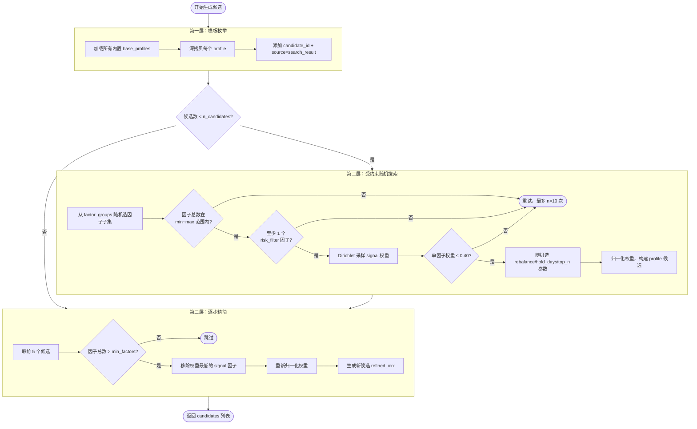
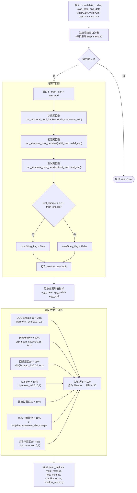
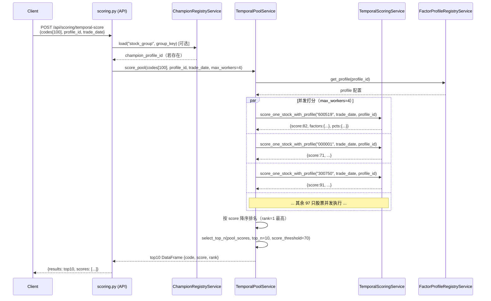
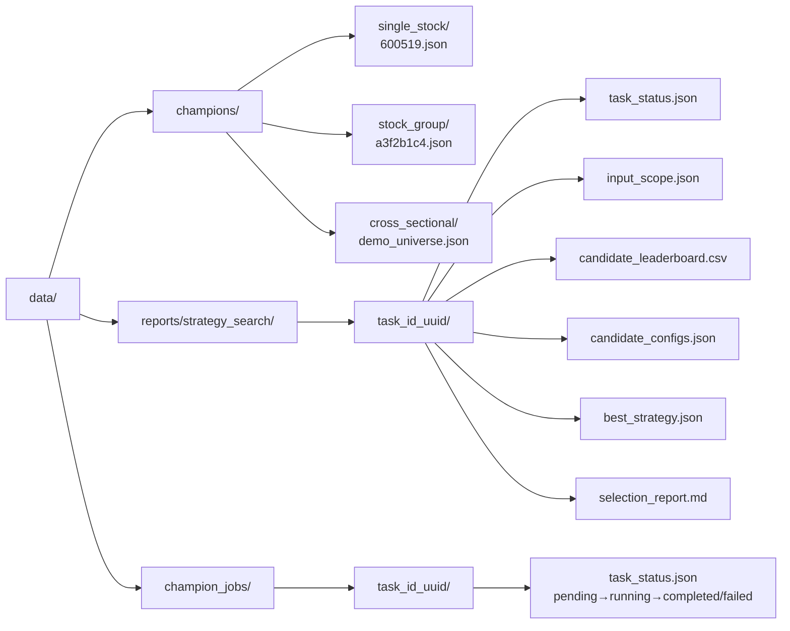

# 自动化策略搜索与 Champion Strategy 流程图

## 1. 整体架构

```mermaid
graph TD
    subgraph 配置层
        CFG1[temporal_pool_profiles.json]
        CFG2[cross_sectional_profiles.json]
        CFG3[strategy_search_space.json]
        CFG4[champion_runtime.json]
    end

    subgraph API层
        API1["POST /champion/temporal-pool"]
        API2["POST /champion/cross-sectional"]
        API3["POST /champion/single-stock"]
        API4["GET /champion/jobs/{task_id}"]
        API5["GET /champions/{scope_type}/{scope_key}"]
    end

    subgraph 搜索与评价
        FPRS[FactorProfileRegistryService<br/>加载/校验 profile & search space]
        SSS[StrategySearchService<br/>三层候选生成]
        SES[StrategyEvaluationService<br/>Walk-Forward 回测 + 稳定性评分]
        CSS[ChampionStrategyService<br/>搜索主控 + 选出 champion]
    end

    subgraph 执行层
        TSS[TemporalScoringService<br/>单股 profile 驱动打分]
        TPS[TemporalPoolService<br/>股票池并发打分 → 排序]
        TFVS[TemporalFilterValidationService<br/>时序池回测]
        VBBS[VectorBTBacktestService<br/>截面回测]
    end

    subgraph 持久化
        CRS[ChampionRegistryService<br/>data/champions/]
        REPORT[data/reports/strategy_search/<br/>leaderboard.csv / report.md]
        JOBS[data/champion_jobs/<br/>task_status.json]
    end

    配置层 --> FPRS
    API1 & API2 & API3 --> JOBS
    API1 & API2 & API3 -->|BackgroundTask| CSS
    API4 --> JOBS
    API5 --> CRS

    FPRS --> SSS
    FPRS --> TSS
    SSS --> CSS
    SES --> CSS
    CSS --> CRS
    CSS --> REPORT

    TPS --> SES
    TFVS --> SES
    VBBS --> SES
    TSS --> TPS
```

---

## 2. Champion 搜索主流程（时序池）

```mermaid
sequenceDiagram
    participant Client
    participant API as search.py (API)
    participant CSS as ChampionStrategyService
    participant SSS as StrategySearchService
    participant FPRS as FactorProfileRegistryService
    participant SES as StrategyEvaluationService
    participant TFVS as TemporalFilterValidationService
    participant TPS as TemporalPoolService
    participant TSS as TemporalScoringService
    participant CRS as ChampionRegistryService

    Client->>API: POST /champion/temporal-pool<br/>{codes, search_space_id, start_date, end_date}
    API->>API: 创建 task_id，写 task_status=pending
    API-->>Client: 202 Accepted {task_id}
    API->>CSS: run_for_pool(codes, search_space_id, ...) [BackgroundTask]

    CSS->>CSS: 校验时间跨度 ≥ 18 个月
    CSS->>CSS: 创建 task_dir，写 task_status=running

    CSS->>SSS: search_for_pool(codes, search_space_id, ...)
    SSS->>FPRS: load_search_space(search_space_id)
    SSS->>FPRS: load_profiles(mode="temporal_pool")
    FPRS-->>SSS: base_profiles[]
    SSS->>SSS: _template_enum(base_profiles) → 第一层候选
    SSS->>SSS: _constrained_random(search_space, n) → 第二层候选
    SSS->>SSS: _forward_selection(top5) → 第三层精简候选
    SSS-->>CSS: candidates[] (≈50个)

    loop 每个候选策略
        CSS->>SES: evaluate_temporal_pool_candidate(candidate, codes, ...)
        SES->>SES: _generate_walk_forward_windows(train=12m, valid=3m, test=3m, step=3m)
        loop 每个滚动窗口
            SES->>TFVS: run_temporal_pool_backtest(codes, profile_id, train_start~train_end)
            TFVS->>TPS: score_pool_history(codes, profile_id, start, end)
            TPS->>TSS: score_one_stock_with_profile(code, date, profile_id) × N [并发]
            TSS-->>TPS: {score, factors, pcts}
            TPS-->>TFVS: pool_scores DataFrame
            TFVS-->>SES: train_metrics {sharpe, annual_return, max_drawdown, ir}
            SES->>TFVS: run_temporal_pool_backtest(..., valid_start~valid_end)
            TFVS-->>SES: valid_metrics
            SES->>TFVS: run_temporal_pool_backtest(..., test_start~test_end)
            TFVS-->>SES: test_metrics
            SES->>SES: overfitting_flag = test_sharpe < 0.3 × train_sharpe
        end
        SES->>SES: compute_stability_score(window_metrics)
        Note over SES: 30%OOS Sharpe + 20%超额收益<br/>+ 15%回撤 + 10%IR<br/>+ 10%正收益窗口 + 10%一致性 + 5%换手率
        SES-->>CSS: {train_metrics, valid_metrics, test_metrics, stability_score}
    end

    CSS->>CSS: 过滤 test_sharpe≤0 或 annual_return<-20% 的候选
    CSS->>CSS: 按 stability_score 降序排序
    CSS->>CSS: 选出 best → 构建 ChampionStrategy
    CSS->>CRS: save("stock_group", group_hash, champion)
    CSS->>CSS: 写 candidate_leaderboard.csv
    CSS->>CSS: 写 selection_report.md
    CSS->>CSS: 更新 task_status=completed
```

---

## 3. 三层候选策略生成

```mermaid
flowchart TD
    START([开始生成候选]) --> L1

    subgraph L1[第一层：模板枚举]
        E1[加载所有内置 base_profiles]
        E2[深拷贝每个 profile]
        E3[添加 candidate_id + source=search_result]
        E1 --> E2 --> E3
    end

    L1 --> CHECK1{候选数 < n_candidates?}
    CHECK1 -- 是 --> L2
    CHECK1 -- 否 --> L3

    subgraph L2[第二层：受约束随机搜索]
        R1[从 factor_groups 随机选因子子集]
        R2{因子总数在<br/>min~max 范围内?}
        R3{至少 1 个<br/>risk_filter 因子?}
        R4[Dirichlet 采样 signal 权重]
        R5{单因子权重 ≤ 0.40?}
        R6[随机选 rebalance/hold_days/top_n 参数]
        R7[归一化权重，构建 profile 候选]
        RETRY([重试，最多 n×10 次])

        R1 --> R2
        R2 -- 否 --> RETRY
        R2 -- 是 --> R3
        R3 -- 否 --> RETRY
        R3 -- 是 --> R4
        R4 --> R5
        R5 -- 否 --> RETRY
        R5 -- 是 --> R6 --> R7
    end

    L2 --> L3

    subgraph L3[第三层：逐步精简]
        F1[取前 5 个候选]
        F2{因子总数 > min_factors?}
        F3[移除权重最低的 signal 因子]
        F4[重新归一化权重]
        F5[生成新候选 refined_xxx]
        F2 -- 否 --> SKIP([跳过])
        F2 -- 是 --> F3 --> F4 --> F5
        F1 --> F2
    end

    L3 --> END([返回 candidates 列表])
```

---

## 4. Walk-Forward 窗口评价

```mermaid
flowchart TD
    INPUT["输入：candidate, codes, start_date, end_date<br/>train=12m, valid=3m, test=3m, step=3m"] --> GEN

    GEN["生成滚动窗口列表<br/>（每步滑动 step_months）"] --> CHECK_WIN{窗口数 ≥ 1?}
    CHECK_WIN -- 否 --> ERR([抛出 ValueError])
    CHECK_WIN -- 是 --> LOOP

    subgraph LOOP[逐窗口回测]
        direction TB
        W1["窗口 i：train_start ~ test_end"]
        BT1["训练期回测<br/>run_temporal_pool_backtest(train_start~train_end)"]
        BT2["验证期回测<br/>run_temporal_pool_backtest(valid_start~valid_end)"]
        BT3["测试期回测<br/>run_temporal_pool_backtest(test_start~test_end)"]
        OVF{"test_sharpe < 0.3 × train_sharpe?"}
        FLAG1[overfitting_flag = True]
        FLAG2[overfitting_flag = False]
        STORE["存入 window_metrics[i]"]

        W1 --> BT1 --> BT2 --> BT3 --> OVF
        OVF -- 是 --> FLAG1 --> STORE
        OVF -- 否 --> FLAG2 --> STORE
    end

    LOOP --> AGG["汇总各期均值指标<br/>agg_train / agg_valid / agg_test"]
    AGG --> SCORE

    subgraph SCORE[稳定性总分计算]
        direction LR
        S1["OOS Sharpe 分 × 30%<br/>clip(mean_sharpe/2, 0,1)"]
        S2["超额收益分 × 20%<br/>clip(mean_excess/0.15, 0,1)"]
        S3["回撤惩罚分 × 15%<br/>clip(1-mean_dd/0.30, 0,1)"]
        S4["IC/IR 分 × 10%<br/>clip(mean_ir/1.5, 0,1)"]
        S5["正收益窗口比 × 10%"]
        S6["风格一致性分 × 10%<br/>1 - std(sharpes)/mean_abs_sharpe"]
        S7["换手率惩罚分 × 5%<br/>clip(1-turnover, 0,1)"]
        SUM["加权求和 × 100<br/>全负 Sharpe → 强制 < 30"]
        S1 & S2 & S3 & S4 & S5 & S6 & S7 --> SUM
    end

    SCORE --> OUT["返回 {train_metrics, valid_metrics,<br/>test_metrics, stability_score, window_metrics}"]
```

---

## 5. 100→10 池内筛选流程（生产调用）

```mermaid
sequenceDiagram
    participant Client
    participant ScoringAPI as scoring.py (API)
    participant CRS as ChampionRegistryService
    participant TPS as TemporalPoolService
    participant TSS as TemporalScoringService
    participant FPRS as FactorProfileRegistryService

    Client->>ScoringAPI: POST /api/scoring/temporal-score<br/>{codes[100], profile_id, trade_date}
    ScoringAPI->>CRS: load("stock_group", group_key) [可选]
    CRS-->>ScoringAPI: champion_profile_id（若存在）

    ScoringAPI->>TPS: score_pool(codes[100], profile_id, trade_date, max_workers=4)
    TPS->>FPRS: get_profile(profile_id)
    FPRS-->>TPS: profile 配置

    par 并发打分（max_workers=4）
        TPS->>TSS: score_one_stock_with_profile("600519", trade_date, profile_id)
        TSS-->>TPS: {score:82, factors:{...}, pcts:{...}}
    and
        TPS->>TSS: score_one_stock_with_profile("000001", trade_date, profile_id)
        TSS-->>TPS: {score:71, ...}
    and
        TPS->>TSS: score_one_stock_with_profile("300750", trade_date, profile_id)
        TSS-->>TPS: {score:91, ...}
    and
        Note over TPS,TSS: ... 其余 97 只股票并发执行 ...
    end

    TPS->>TPS: 按 score 降序排名（rank=1 最高）
    TPS->>TPS: select_top_n(pool_scores, top_n=10, score_threshold=70)
    TPS-->>ScoringAPI: top10 DataFrame {code, score, rank}
    ScoringAPI-->>Client: {results: top10, scores: [...]}
```

---

## 6. Champion 文件存储结构

```mermaid
graph LR
    ROOT[data/] --> CHAMP[champions/]
    ROOT --> REPORTS[reports/strategy_search/]
    ROOT --> JOBS[champion_jobs/]

    CHAMP --> SS[single_stock/<br/>600519.json]
    CHAMP --> SG[stock_group/<br/>a3f2b1c4.json]
    CHAMP --> CS[cross_sectional/<br/>demo_universe.json]

    REPORTS --> TASK[task_id_uuid/]
    TASK --> T1[task_status.json]
    TASK --> T2[input_scope.json]
    TASK --> T3[candidate_leaderboard.csv]
    TASK --> T4[candidate_configs.json]
    TASK --> T5[best_strategy.json]
    TASK --> T6[selection_report.md]

    JOBS --> JOB[task_id_uuid/]
    JOB --> J1[task_status.json<br/>pending→running→completed/failed]
```
